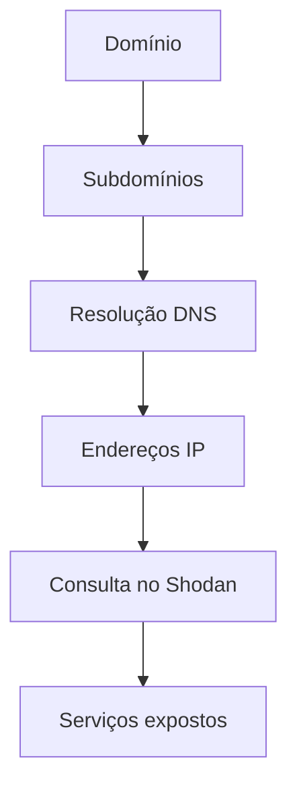
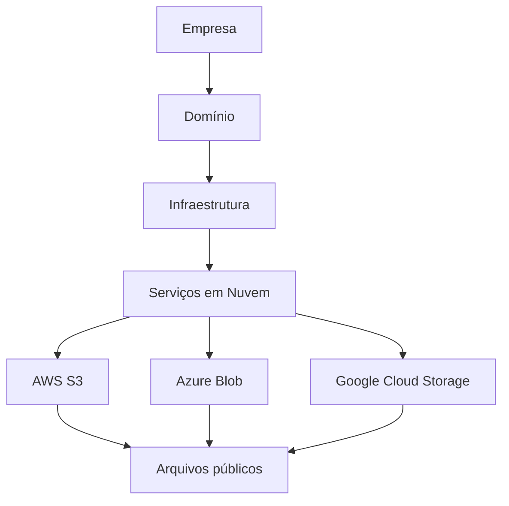
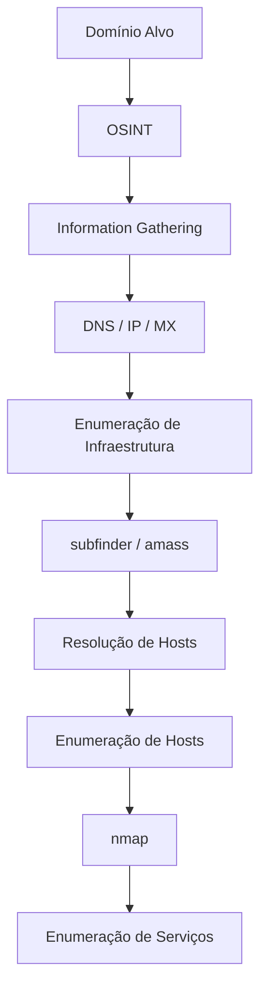

# 🔎 Fluxo de Reconhecimento (Recon)

O **Reconhecimento (Recon)** é a fase inicial de um **pentest ou bug bounty**, onde coletamos o máximo de informações possíveis sobre o alvo antes de tentar explorá-lo.

🎯 **Objetivo:**
Não é apenas encontrar **uma forma de entrar no sistema**, mas descobrir **TODAS as possíveis formas de acesso**.

---

# 📊 Etapas do Reconhecimento

## 🧾 1. Information Gathering (Coleta de Informações)

Nesta fase coletamos **informações gerais sobre o alvo**.

🔎 Exemplos de informações coletadas:

- Domínios
- Subdomínios
- Endereços IP
- Servidores
- Emails
- Tecnologias utilizadas

💡 Aqui utilizamos muito **OSINT**.

### 🌐 OSINT (Open Source Intelligence)

Consiste em coletar informações de **fontes públicas**, como:

- Google
- GitHub
- DNS públicos
- Redes sociais
- Documentações públicas

📌 **Importante:**
Não há interação direta com o alvo.

---

## 🧩 2. Enumeração

Após coletar informações iniciais, começamos a **extrair detalhes dessas informações**.

🎯 Objetivo: **Entender como o sistema funciona**.

### Exemplos de enumeração

- Enumeração de usuários
- Enumeração de diretórios
- Enumeração de serviços
- Descoberta de tecnologias

---

# ⚙️ Tipos de Enumeração

## 🕵️ Enumeração Passiva

Não há contato direto com o alvo.

📚 Utiliza apenas **fontes públicas**.

Exemplos:

- DNS públicos
- Certificados SSL
- Motores de busca
- Repositórios públicos

✔️ **Vantagem:** não gera alertas.

---

## ⚡ Enumeração Ativa

Há **contato direto com o alvo**.

O sistema pode detectar sua atividade.

Exemplos:

- Port Scanning
- Brute force de diretórios
- Requisições HTTP
- Enumeração de serviços

⚠️ Pode gerar **logs e alertas de segurança**.

---

# 🎯 Estratégia no Recon

Durante o reconhecimento devemos:

- ❌ **Evitar ataques agressivos no início**
- 🧠 **Entender a infraestrutura**
- 🔍 **Identificar todas as superfícies de ataque**

Depois disso, escolhemos **a melhor estratégia de exploração**.

---

# 👀 Mentalidade de Análise

Durante o Recon devemos sempre analisar:

### 🔎 O que podemos ver

- O que está exposto?
- Por que está exposto?
- Que informação isso transmite?
- Como podemos usar isso?

---

### 🔒 O que não podemos ver

- Por que não conseguimos ver?
- Existe alguma forma indireta de descobrir?
- O que isso indica sobre a segurança?

---

# 🧠 Princípios de Enumeração

Alguns princípios importantes:

1️⃣ **Há sempre mais do que parece à primeira vista**

2️⃣ **Considere diferentes perspectivas**

3️⃣ **Distinguir entre:**

- o que vemos
- o que não vemos

4️⃣ **Sempre existem outras formas de obter informação**

5️⃣ **Compreender o alvo é essencial**

---

# 🏗️ Metodologia de Enumeração

Para evitar esquecer pontos importantes, utilizamos uma **metodologia estruturada**.

Essa metodologia possui:

- **3 níveis**
- **6 camadas**

Cada camada representa **um obstáculo a ser superado**.

---

# 🧱 Níveis e Camadas da Enumeração

## 🌐 1️⃣ Enumeração de Infraestrutura

### Camadas:

- **Internet Presence**
- **Gateway**

---

## 💻 2️⃣ Enumeração de Hosts

### Camadas:

- **Serviços acessíveis**
- **Processos**

---

## ⚙️ 3️⃣ Enumeração do Sistema Operacional

### Camadas:

- **Privilégios**
- **Configuração do S.O**

---

# 🧭 As 6 Camadas da Enumeração

## 🌍 Camada 1 — Internet Presence

Identificar a **presença do alvo na internet**.

🔎 Informações buscadas:

- Domínio
- Subdomínio
- ASN
- Blocos de rede
- Endereços IP
- Tecnologias utilizadas
- Medidas de segurança

📌 Aqui utilizamos principalmente **OSINT**.

---

## 🛡️ Camada 2 — Gateway

Identificar **mecanismos de segurança** que protegem a infraestrutura.

Exemplos:

- Firewall
- IDS / IPS
- Proxies
- NAC
- VPN
- Cloudflare
- Segmentação de rede

🎯 Objetivo: entender **como a infraestrutura é protegida**.

---

## 🌐 Camada 3 — Serviços Acessíveis

Identificar **serviços disponíveis no sistema**.

Informações coletadas:

- Tipo de serviço
- Porta
- Versão
- Função
- Configuração

Exemplos de serviços:

- HTTP
- SSH
- FTP
- SMTP
- APIs

---

## ⚙️ Camada 4 — Processos

Todo serviço executa **processos internos**.

Devemos identificar:

- PID (Process ID)
- Origem dos dados
- Destino dos dados
- Tarefas executadas

🎯 Objetivo: entender **como o sistema processa informações**.

---

## 🔑 Camada 5 — Privilégios

Cada serviço é executado por um **usuário específico**.

Devemos identificar:

- Usuários
- Grupos
- Permissões
- Restrições
- Ambiente de execução

Isso ajuda a entender **o que é possível fazer dentro do sistema**.

---

## 🖥️ Camada 6 — Configuração do Sistema Operacional

Coletar informações sobre o **sistema operacional**.

Exemplos:

- Tipo de sistema operacional
- Nível de patch
- Configuração de rede
- Arquivos de configuração
- Arquivos sensíveis

🎯 Objetivo: entender **a segurança interna do sistema**.

---

# 🧩 Visualizando o Processo

Podemos imaginar o **pentest como um labirinto** 🧩

Nosso trabalho é:

1️⃣ Identificar brechas
2️⃣ Encontrar caminhos possíveis
3️⃣ Escolher a melhor rota para chegar ao objetivo

⚡ Em **Bug Bounty**, isso deve ser feito **da forma mais rápida possível**, sem perder a qualidade da análise.

---

# 🌐 Informações de Domínio

O estudo do domínio vai além de encontrar **subdomínios**.

Devemos compreender:

- Como a empresa funciona
- Quais tecnologias utiliza
- Quais serviços oferece
- Qual infraestrutura é necessária

📌 Tudo isso pode gerar **novas superfícies de ataque**.

---

# 🧠 O que vemos vs O que não vemos

### 👁️ O que vemos

O **serviço exposto**.

Exemplo:

```
site.com
```

---

### 🔍 O que não vemos

A **infraestrutura necessária para o serviço funcionar**, como:

- Banco de dados
- APIs internas
- Sistemas de autenticação
- Back-end

💡 Devemos pensar **como um desenvolvedor** para entender toda a estrutura.

---

# 🌍 Presença Online

Após entender a empresa, analisamos sua **presença online**.

Objetivo:

- Encontrar novos ativos
- Expandir o escopo
- Descobrir novas interfaces

---

# 🔐 Certificate Transparency Recon

Uma técnica importante é analisar **certificados SSL públicos**.

## 📜 Certificado SSL

Um **certificado SSL** é um arquivo digital que garante:

- 🔒 Integridade dos dados
- 🔒 Privacidade na comunicação

Muitos **subdomínios utilizam o mesmo certificado**.

---

## 🔎 Buscando Subdomínios com crt.sh

Ferramenta:

```
https://crt.sh/
```

Ela permite consultar **certificados públicos**.

---

## 🧪 Exemplo de comando

```bash
curl -s https://crt.sh/?q=meusite.com&output=json \
| jq . \
| grep name \
| cut -d":" -f2 \
| grep -v "CN=" \
| cut -d'"' -f2 \
| awk '{gsub(/\\n/,"\n");}1;' \
| sort -u
```

---

## 🧠 Explicação do comando

### curl

Faz a requisição HTTP:

```bash
curl https://crt.sh/?q=meusite.com&output=json
```

Parâmetros:

- `q=` → domínio pesquisado
- `output=json` → retorno em JSON
- `-s` → modo silencioso

---

### jq

Formata o JSON para ficar **legível**.

---

### grep name

Filtra apenas linhas contendo **name**.

---

### cut

Separa os campos.

Exemplo:

```
cut -d":" -f2
```

- `-d` → delimitador
- `-f` → campo selecionado

---

### grep -v

Remove linhas indesejadas.

```
grep -v "CN="
```

---

### awk

Substitui `\n` por **quebras de linha reais**.

Exemplo:

```
example.com\napi.example.com\nwww.example.com
```

Se transforma em:

```
example.com
api.example.com
www.example.com
```

---

### sort -u

Remove **duplicados**.

- `sort` → ordena
- `-u` → remove duplicados

---

# 🧹 Versão Mais Limpa do Comando

```bash
curl -s "https://crt.sh/?q=%25.meusite.com&output=json" \
| jq -r '.[].name_value' \
| tr '\n' '\n' \
| sort -u
```

🎯 Resultado: lista de **subdomínios únicos** encontrados nos certificados.

---

# 🖥️ Identificando Hosts da Empresa

Durante o **Recon**, é essencial descobrir **quais hosts realmente pertencem à empresa**.

⚠️ **Importante em Bug Bounty e Pentest:**

Não temos autorização para testar **infraestruturas de terceiros**.

Exemplo:

- Muitos sites usam **CDN**, **Cloud providers** ou **serviços terceirizados**.
- Atacar esses serviços **sem autorização** pode gerar problemas legais.

🎯 Portanto precisamos identificar:

- Quais **hosts são realmente da empresa**
- Quais são **infraestruturas terceirizadas**

---

# 🔎 Descobrindo IPs dos Subdomínios

Depois de encontrar subdomínios, precisamos **resolver seus endereços IP**.

Para isso utilizamos **consultas DNS**.

---

## 📜 Comando Utilizado

```bash
for i in $(cat subdomainlist); do
host $i | grep "has address" | grep meusite.com | cut -d" " -f1,4
done
```

---

# 🧠 Explicação do Comando

## 🔁 Loop `for`

```bash
for i in $(cat subdomainlist)
```

Esse loop percorre **todos os subdomínios dentro de um arquivo**.

📄 Exemplo do arquivo:

```
sub1.meusite.com
api.meusite.com
dev.meusite.com
```

Cada item será armazenado na variável:

```
$i
```

---

## 🌐 Comando `host`

```bash
host $i
```

O comando **host** realiza uma **consulta DNS**.

Ele retorna informações como:

- IP do domínio
- registros DNS
- aliases

Exemplo de saída:

```
api.meusite.com has address 192.168.1.10
```

---

## 🔍 Filtrando a resposta

### grep "has address"

```bash
grep "has address"
```

Filtra apenas linhas que contêm **endereços IP**.

Exemplo:

```
api.meusite.com has address 192.168.1.10
```

---

### grep meusite.com

```bash
grep meusite.com
```

Mantém apenas resultados relacionados ao **domínio alvo**.

Isso ajuda a remover possíveis **redirecionamentos ou registros externos**.

---

## ✂️ Comando `cut`

```bash
cut -d" " -f1,4
```

Esse comando separa os campos da linha.

Parâmetros:

- `-d` → delimitador (espaço)
- `-f` → campos que queremos

Campos selecionados:

| Campo | Conteúdo    |
| ----- | ----------- |
| 1     | domínio     |
| 4     | endereço IP |

---

### 📊 Resultado final

Exemplo de saída:

```
api.meusite.com 192.168.1.10
dev.meusite.com 192.168.1.20
```

Assim conseguimos **mapear subdomínios e seus IPs**.

---

# 🌐 Utilizando o Shodan

## 🔎 O que é Shodan?

O **Shodan** é um **motor de busca para dispositivos conectados à internet**.

Ele funciona como um **Google da infraestrutura da internet**.

🔎 Ele indexa informações como:

- Servidores
- Serviços expostos
- Versões de software
- Tecnologias utilizadas
- Dispositivos conectados

---

## 📊 Informações que o Shodan pode mostrar

- SSH
- FTP
- HTTP
- Banco de dados
- Firewalls
- Docker
- Kubernetes
- IoT (câmeras, roteadores)

Exemplo de informação coletada:

```
Apache 2.4
OpenSSH 7.6
nginx
```

---

# ⚙️ Como o Shodan Funciona

O Shodan possui um **crawler próprio** que faz **scan da internet**.

Esse crawler:

1️⃣ Conecta aos servidores
2️⃣ Recebe o **banner do serviço**
3️⃣ Armazena as informações no banco de dados

---

### 📜 Banner

O **banner** é a resposta inicial de um servidor.

Exemplo:

```
Apache/2.4.41 (Ubuntu)
```

Ele pode revelar:

- versão do software
- sistema operacional
- configurações

---

# 🔁 Fluxo de Recon até agora

O fluxo do reconhecimento até este ponto é:

```
Domínio
     ↓
Subdomínios
     ↓
Resolução DNS
     ↓
Endereços IP
     ↓
Consulta no Shodan
     ↓
Descoberta de serviços expostos
```

---

# 🕵️ Consulta Passiva

Consultar o **Shodan** é considerado **reconhecimento passivo**.

✔️ Não enviamos requisições diretas ao alvo.
✔️ Consultamos apenas **um banco de dados público**.

---

### ⚡ Comparação

| Método | Tipo    |
| ------ | ------- |
| Shodan | Passivo |
| Nmap   | Ativo   |

Exemplo com **Nmap**:

```bash
nmap 192.168.1.10
```

Nesse caso o alvo **recebe requisições diretamente**.

---

# 🧪 Consultando IPs no Shodan

## 📜 Comando

```bash
for i in $(cat ip-addresses.txt); do
shodan host $i
done
```

---

# 🧠 Explicação

## 🔁 Loop `for`

Percorre todos os IPs do arquivo:

```
ip-addresses.txt
```

Exemplo:

```
192.168.1.10
192.168.1.20
192.168.1.30
```

---

## 🌐 Comando `shodan host`

```bash
shodan host 192.168.1.10
```

Consulta o banco de dados do Shodan para esse IP.

Ele retorna informações como:

- portas abertas
- serviços ativos
- versões de software
- localização do servidor

---

# ⚠️ Observação Importante

Para usar o **CLI do Shodan**, geralmente é necessário:

- criar uma conta
- obter uma **API Key**
- possuir **plano pago**

---

# 📊 Fluxo Final do Recon



---

✅ Agora você possui um **workflow completo até a fase de enumeração de serviços**, incluindo:

- identificação de hosts
- resolução DNS
- filtragem de IPs
- consulta passiva no Shodan

---

# ☁️ Cloud Resources no Reconhecimento

Muitas empresas utilizam **serviços em nuvem** para armazenar arquivos, executar aplicações e hospedar infraestrutura.

Principais provedores:

| Provedor     | Empresa               |
| ------------ | --------------------- |
| ☁️ **AWS**   | Amazon                |
| ☁️ **GCP**   | Google Cloud Platform |
| ☁️ **Azure** | Microsoft             |

Esses serviços são muito utilizados porque oferecem:

* escalabilidade
* alta disponibilidade
* integração com diversas aplicações

⚠️ Porém, **configurações incorretas podem deixar dados expostos publicamente**.

---

# ⚠️ Riscos de Configuração em Nuvem

Serviços de armazenamento em nuvem podem ser configurados como:

* 🔒 **Privados**
* 🌍 **Públicos**

Se estiverem **mal configurados**, qualquer pessoa pode acessar os arquivos.

Isso pode expor:

* backups
* arquivos internos
* documentos confidenciais
* credenciais
* chaves SSH

---

# 📦 Principais Serviços de Armazenamento

Cada provedor possui seu próprio serviço de armazenamento.

| Provedor | Serviço           |
| -------- | ----------------- |
| AWS      | **S3 Buckets**    |
| Azure    | **Blob Storage**  |
| GCP      | **Cloud Storage** |

Esses serviços armazenam arquivos como:

* imagens
* backups
* documentos
* arquivos de configuração
* dados de aplicações

---

# 🔎 Como Encontrar Armazenamento em Nuvem

Uma forma simples é usar **Google Dorks**.

### 🔍 Pesquisando S3 Buckets (AWS)

```id="i8b9ho"
intext:<nome_da_empresa> inurl:amazonaws.com
```

---

### 🔍 Pesquisando Azure Blob Storage

```id="x98lre"
intext:<nome_da_empresa> inurl:blob.core.windows.net
```

---

### 🔍 Pesquisando Google Cloud Storage

```id="p3v0sh"
intext:<nome_da_empresa> inurl:storage.googleapis.com
```

Essas buscas podem revelar **links diretos para arquivos armazenados na nuvem**.

---

# 🌐 Domain Glass

O **Domain Glass** é uma ferramenta usada para **analisar informações de um domínio**.

Ele mostra dados da infraestrutura, como:

* endereço IP
* nameservers
* registros WHOIS
* hostnames associados

---

## 📊 Informações que podemos obter

| Informação | Descrição                          |
| ---------- | ---------------------------------- |
| IP         | endereço do servidor               |
| Nameserver | servidor DNS responsável           |
| Whois      | informações do registro do domínio |
| Hostnames  | domínios relacionados              |

---

## 🎯 Utilidade no Recon

Com o Domain Glass podemos descobrir:

* se o domínio utiliza **serviços em nuvem**
* se existem **CDNs ou proxies**
* possíveis **mecanismos de proteção**

Exemplo:

* Cloudflare
* AWS
* Azure

Isso indica que **podemos encontrar obstáculos nas próximas etapas do recon**.

---

# 🔎 GreyHat Warfare

O **GreyHat Warfare** é uma ferramenta OSINT usada para encontrar **arquivos públicos armazenados em nuvens**.

Ele indexa arquivos encontrados em serviços como:

* Amazon S3
* Azure Blob Storage
* Google Cloud Storage
* DigitalOcean Spaces

---

# 📦 O que é um Bucket

Um **bucket** é um espaço de armazenamento na nuvem.

Ele funciona como uma **pasta gigante de arquivos**.

Exemplo:

```id="pqrr3c"
empresa-backups
empresa-assets
logs-prod
```

Se o bucket estiver **público**, qualquer pessoa pode acessar os arquivos.

---

# ⚠️ Risco de Buckets Públicos

Muitas empresas configuram buckets como públicos para:

* hospedar imagens
* disponibilizar arquivos de download

Porém, às vezes arquivos **sensíveis são armazenados nesses buckets**.

Exemplos:

* backups de banco de dados
* arquivos de configuração
* logs
* credenciais

---

# 🔍 Tipos de Pesquisa no GreyHat Warfare

Podemos buscar arquivos utilizando:

| Tipo de busca     | Exemplo         |
| ----------------- | --------------- |
| Nome do arquivo   | backup.sql      |
| Tipo de arquivo   | .env            |
| Palavra-chave     | password        |
| Bucket específico | empresa-backups |

---

# 🔑 Arquivos Sensíveis que Podemos Encontrar

Alguns arquivos são **especialmente críticos**.

Exemplo:

### Chaves SSH

```id="ugvwy7"
id_rsa
id_rsa.pub
```

Esses arquivos são usados para **autenticação SSH**.

Se expostos publicamente, podem permitir:

* acesso a servidores
* comprometimento da infraestrutura

---

# 🧠 Fluxo de Recon em Cloud Resources



---

# 🎯 Objetivo da Enumeração em Cloud

Durante o recon queremos descobrir:

* buckets públicos
* arquivos sensíveis
* configurações expostas
* possíveis credenciais

Isso pode revelar **informações críticas sem precisar atacar diretamente o sistema**.

---

✅ Essa etapa é extremamente poderosa em **Bug Bounty**, porque muitas vezes permite encontrar **dados sensíveis usando apenas OSINT**, sem interação direta com o alvo.

---

# 👥 Funcionários (OSINT)

Durante a fase de **reconhecimento**, podemos coletar informações sobre **funcionários da empresa**.

Uma das principais fontes é o **LinkedIn**.

---

## 🔎 O que analisar

Buscar principalmente profissionais das áreas:

| Área               | Motivo                                            |
| ------------------ | ------------------------------------------------- |
| 🔐 Segurança       | podem revelar ferramentas e práticas de segurança |
| 💻 Desenvolvimento | indicam linguagens e frameworks utilizados        |

Também podemos analisar:

* habilidades listadas
* projetos desenvolvidos
* certificações
* tecnologias mencionadas

Essas informações podem indicar **quais tecnologias a empresa utiliza**.

---

## 💼 Análise de Vagas

As **vagas de emprego** também são ótimas fontes de informação.

Exemplos do que podemos descobrir:

| Informação     | Exemplo            |
| -------------- | ------------------ |
| Linguagens     | Python, Java, PHP  |
| Frameworks     | React, Django      |
| Infraestrutura | AWS, Azure         |
| Ferramentas    | Docker, Kubernetes |

---

## 🔍 Após identificar tecnologias

Quando identificamos as tecnologias usadas pela empresa podemos:

1. Pesquisar **documentação oficial**
2. Verificar **boas práticas de segurança**
3. Procurar **vulnerabilidades conhecidas**

Muitas organizações seguem **configurações padrão**, o que pode resultar em:

* nomes de arquivos previsíveis
* diretórios padrão
* configurações inseguras

---

# 🖥️ Enumeração Baseada em Infraestrutura vs Hosts

Existem dois tipos principais de enumeração.

---

## 🌐 Enumeração de Infraestrutura

Foca na **estrutura geral da organização**.

Objetivo: entender **como os sistemas estão organizados**.

Exemplos de informações coletadas:

| Tipo           | Exemplos        |
| -------------- | --------------- |
| Domínios       | subdomínios     |
| DNS            | registros DNS   |
| Infraestrutura | servidores web  |
| Cloud          | AWS, Azure, GCP |
| CDN            | Cloudflare      |

---

## 🖥️ Enumeração Baseada em Hosts

Foca em **máquinas específicas da rede**.

Objetivo: descobrir detalhes técnicos de cada sistema.

| Informação          | Exemplo           |
| ------------------- | ----------------- |
| Sistema Operacional | Linux / Windows   |
| Serviços            | FTP, SSH, HTTP    |
| Versões             | Apache 2.4        |
| Portas              | 21, 22, 80        |
| Usuários            | contas do sistema |

---

# 📁 FTP — File Transfer Protocol

O **FTP** é um protocolo utilizado para:

* enviar arquivos
* baixar arquivos
* gerenciar arquivos em servidores

Ele opera na **camada de aplicação**, assim como:

| Protocolo | Função                    |
| --------- | ------------------------- |
| HTTP      | navegação web             |
| POP       | recebimento de e-mail     |
| FTP       | transferência de arquivos |

---

## ⚠️ Segurança do FTP

O FTP **não é seguro**, pois envia dados em **texto puro (clear text)**.

Isso inclui:

* usuário
* senha

Alternativas seguras:

| Protocolo | Segurança       |
| --------- | --------------- |
| SFTP      | FTP sobre SSH   |
| FTPS      | FTP com SSL/TLS |

---

# ⚙️ Funcionamento do FTP

Uma conexão FTP utiliza **dois canais diferentes**.

| Porta | Função            |
| ----- | ----------------- |
| 21    | canal de controle |
| 20    | canal de dados    |

---

## 📡 Canal de Controle

Utilizado para:

* envio de comandos
* comunicação cliente-servidor

O servidor responde com **status codes**.

---

## 📂 Canal de Dados

Utilizado para:

* transferência de arquivos
* listagem de diretórios

O protocolo pode:

* detectar erros
* retomar transferências interrompidas

---

# 🔄 Modos de Conexão FTP

Existem dois modos de funcionamento.

---

## 🔹 Modo Ativo

Fluxo:

| Etapa | Ação                             |
| ----- | -------------------------------- |
| 1     | cliente conecta na porta 21      |
| 2     | servidor inicia conexão de dados |
| 3     | servidor usa porta 20            |

Problema:

Se o cliente estiver protegido por **firewall**, o servidor pode não conseguir enviar dados.

---

## 🔹 Modo Passivo

Nesse modo o **cliente inicia a conexão de dados**.

Fluxo:

| Etapa | Ação                            |
| ----- | ------------------------------- |
| 1     | cliente conecta ao servidor     |
| 2     | cliente inicia conexão de dados |

Isso evita bloqueios de firewall.

---

# 📦 TFTP — Trivial File Transfer Protocol

O **TFTP** é uma versão simplificada do FTP.

Principais diferenças:

| FTP                 | TFTP                    |
| ------------------- | ----------------------- |
| usa TCP             | usa UDP                 |
| possui autenticação | não possui autenticação |
| mais recursos       | recursos limitados      |

Por ser **não confiável**, normalmente é utilizado apenas em **redes locais protegidas**.

---

# 🧰 Servidor FTP — vsFTPd

Um dos servidores FTP mais utilizados é o **vsFTPd**.

Instalação:

```bash
sudo apt install vsftpd
```

---

## ⚙️ Arquivo de Configuração

Arquivo principal:

```bash
/etc/vsftpd.conf
```

Mostrar apenas configurações ativas:

```bash
cat /etc/vsftpd.conf | grep -v "#"
```

---

## 🚫 Usuários Bloqueados

Arquivo que define usuários que **não podem acessar FTP**.

```bash
cat /etc/ftpusers
```

---

# 👤 Login Anônimo

O FTP pode permitir **acesso anônimo**.

Configurações importantes:

| Configuração            | Função                         |
| ----------------------- | ------------------------------ |
| anonymous_enable        | permitir login anônimo         |
| anon_upload_enable      | permitir upload                |
| anon_mkdir_write_enable | permitir criação de diretórios |
| anon_root               | diretório do usuário anônimo   |
| write_enable            | permitir comandos de escrita   |

Normalmente usado apenas em **redes internas**.

---

# 🔑 Acesso Anônimo

Conectar ao servidor:

```bash
ftp 10.129.14.136
```

Login:

```
user: anonymous
senha: guest
```

---

## 📢 Banner do Servidor

Ao conectar, o servidor retorna um **status code** e um **banner**.

Exemplo:

```
220 FTP Server Ready
```

O banner pode revelar:

* versão do servidor
* tipo de software
* sistema operacional

---

# 📂 Comandos FTP

| Comando | Função                  |
| ------- | ----------------------- |
| status  | informações do servidor |
| debug   | modo de depuração       |
| trace   | rastrear comandos       |
| ls      | listar arquivos         |

---

# 📥 Download de Arquivos

Baixar arquivo:

```bash
get arquivo.txt
```

Baixar vários arquivos pode gerar **alertas de segurança**.

---

# 📤 Upload de Arquivos

Enviar arquivo:

```bash
put arquivo.txt
```

Se o FTP estiver ligado a um **servidor web**, pode permitir:

* upload de web shell
* execução remota de código
* elevação de privilégios

---

# ⚠️ Possíveis Explorações

Um FTP mal configurado pode permitir:

* acesso a arquivos sensíveis
* **LFI (Local File Inclusion)**
* **RCE (Remote Code Execution)**
* exploração de logs

---

# 🔎 Footprinting do Serviço

Para descobrir serviços usamos **scanners de rede**.

Ferramenta mais utilizada:

| Ferramenta | Uso                                 |
| ---------- | ----------------------------------- |
| Nmap       | descoberta e enumeração de serviços |

---

# 🧠 Nmap Scripting Engine (NSE)

O **NSE** permite executar scripts para:

* detectar vulnerabilidades
* coletar informações
* automatizar enumeração

Documentação:

```
https://nmap.org/book/nse.html
```

---

## 🔍 Encontrar Scripts FTP

```bash
find / -type f -name ftp* 2>/dev/null | grep scripts
```

---

# ⚙️ Flags Importantes do Nmap

| Flag | Função                     |
| ---- | -------------------------- |
| -sV  | detectar versão do serviço |
| -A   | detecção completa          |
| -sC  | executar scripts padrão    |

---

## 🔎 Scan FTP

```bash
sudo nmap -sV -p21 -sC -A 10.129.14.136
```

⚠️ A flag **-A** gera mais tráfego e é considerada **agressiva**.

---

# 🔧 Alternativas ao Nmap

| Ferramenta | Uso             |
| ---------- | --------------- |
| netcat     | conexão manual  |
| telnet     | teste de portas |

Exemplo:

```bash
nc -nv <IP>
```

---

# 🔐 FTP com TLS/SSL

Se o FTP usar criptografia, podemos usar **OpenSSL**.

```bash
openssl s_client -connect 10.129.14.136:21 -starttls ftp
```

---

# 🧠 Fluxo de Reconhecimento

Até o momento o fluxo de enumeração segue este processo:



---

## 🎯 Objetivo das Etapas

| Etapa                  | Objetivo                       |
| ---------------------- | ------------------------------ |
| OSINT                  | descobrir informações públicas |
| Information Gathering  | coletar dados técnicos         |
| Enumeração de Infra    | mapear estrutura da empresa    |
| Enumeração de Hosts    | analisar máquinas específicas  |
| Enumeração de Serviços | investigar serviços expostos   |

---

# 📂 NFS (Network File System)

O **NFS** também permite **acessar arquivos remotos como se fossem locais**.

Ele é muito utilizado em **ambientes Linux/Unix**.

⚠️ Diferente do SMB:

> NFS **não se comunica com servidores SMB**.

---

## 📌 Versão atual

A versão mais recente é:

**NFSv4**

---

# 🚪 Porta utilizada pelo NFS

O NFS utiliza principalmente:

* **2049**

Outras portas importantes:

* **111** (RPC)

---

# ⚙️ Arquivo de Configuração do NFS

Arquivo principal:

```
/etc/exports
```

Ele define **quais diretórios serão compartilhados**.

---

## 📄 Exemplo de configuração

```bash
echo '/minha_pasta/arquivo 10.129.14.0/24(sync,no_subtree_check)' >> /etc/exports
```

### O que isso significa

* Compartilha `/minha_pasta/arquivo`
* Permite acesso à rede `10.129.14.0/24`

Todos os hosts dessa rede podem **acessar o conteúdo**.

---

# ⚠️ Configurações Perigosas no NFS

Algumas configurações podem gerar vulnerabilidades.

| Configuração     | Risco                        |
| ---------------- | ---------------------------- |
| `rw`             | leitura e escrita            |
| `insecure`       | permite portas acima de 1024 |
| `nohide`         | mostra diretórios filhos     |
| `no_root_squash` | root remoto vira root local  |

---

### 🚨 no_root_squash

Essa é **uma das configurações mais perigosas**.

Ela permite que um usuário **root remoto mantenha UID 0 no servidor**.

Isso pode permitir:

* modificar arquivos críticos
* alterar scripts
* escalar privilégios

---

# 🔎 Footprinting NFS

Durante a enumeração devemos procurar principalmente:

* **porta 111**
* **porta 2049**

Essas portas indicam serviço NFS ativo.

---

# 🛰️ Enumeração NFS com Nmap

```bash
sudo nmap <IP_ALVO> -p111,2049 -sV -sC
```

Ou usando scripts específicos:

```bash
sudo nmap --script nfs* <IP> -p111,2049 -sV
```

---

# 📜 Descobrindo Compartilhamentos NFS

Ferramenta:

```bash
showmount -e <IP>
```

Ela mostra **quais diretórios estão exportados**.

---

# 🔌 Conectando a um Servidor NFS

Primeiro criamos um diretório local:

```bash
mkdir /mnt/nfs
```

Depois montamos o compartilhamento:

```bash
sudo mount -t nfs <IP_ALVO>:/caminho/do/arquivo /mnt/nfs -o nolock
```

### Parâmetros

* `<IP_ALVO>` → servidor NFS
* `/caminho/do/arquivo` → diretório exportado
* `/mnt/nfs` → diretório local

Após montar, os arquivos podem ser **acessados localmente**.

---

# 🎯 Importância em Pentest

Serviços SMB e NFS são **alvos extremamente comuns em redes internas**.

Eles podem revelar:

* credenciais
* arquivos de configuração
* backups
* scripts administrativos
* usuários do domínio


