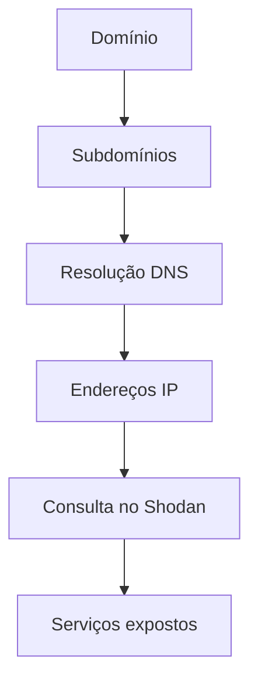
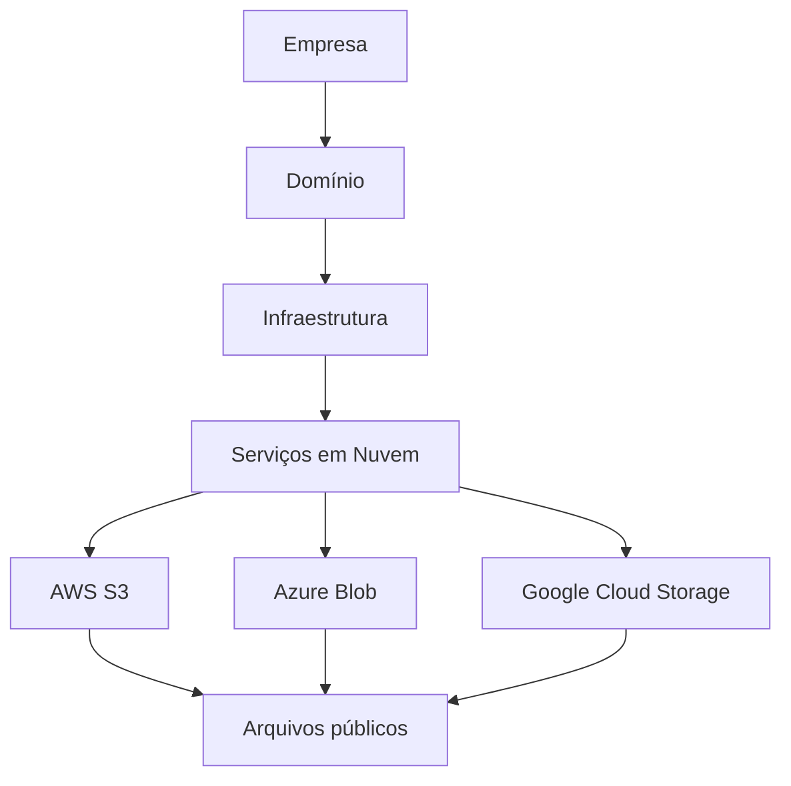
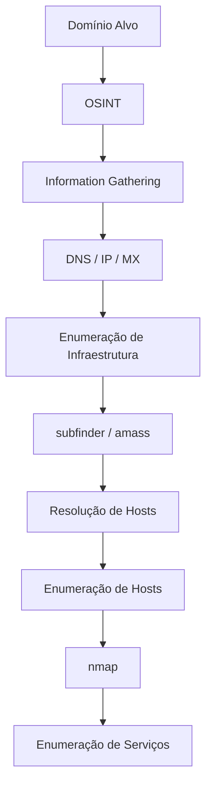

# 📑 Índice

| Seção | Descrição |
|------|----------|
| [🔎 Introdução ao Footprinting](#-introdução-ao-footprinting) | Conceito e importância do footprinting no pentest |
| [🎯 Objetivo do Reconhecimento](#-objetivo-do-reconhecimento) | O que buscamos durante o reconhecimento |
| [📊 Tipos de Footprinting](#-tipos-de-footprinting) | Diferença entre passivo e ativo |
| [🕵️ Footprinting Passivo](#️-footprinting-passivo) | Coleta de dados sem interação com o alvo |
| [⚡ Footprinting Ativo](#-footprinting-ativo) | Coleta com interação direta |
| [🌐 OSINT](#-osint) | Inteligência de fontes abertas |
| [🔍 Coleta de Informações](#-coleta-de-informações) | Dados iniciais do alvo |
| [🌍 Domínios e Subdomínios](#-domínios-e-subdomínios) | Descoberta de ativos web |
| [📡 Endereços IP](#-endereços-ip) | Identificação de infraestrutura |
| [📧 Emails](#-emails) | Coleta de usuários e possíveis alvos |
| [🧰 Ferramentas de Footprinting](#-ferramentas-de-footprinting) | Ferramentas utilizadas no processo |
| [🕸️ DNS Enumeration](#-dns-enumeration) | Enumeração de registros DNS |
| [📜 WHOIS](#-whois) | Informações de registro de domínio |
| [🔗 Serviços Web](#-serviços-web) | Identificação de tecnologias e servidores |
| [📂 Metadados](#-metadados) | Extração de informações ocultas em arquivos |
| [📱 Redes Sociais](#-redes-sociais) | Coleta de dados via engenharia social |
| [🧠 Estratégia de Ataque](#-estratégia-de-ataque) | Como usar as informações coletadas |
| [🚀 Resumo](#-resumo) | Revisão geral do conteúdo |


# 🔎 Fluxo de Reconhecimento (Recon)

O **Reconhecimento (Recon)** é a fase inicial de um **pentest ou bug bounty**, onde coletamos o máximo de informações possíveis sobre o alvo antes de tentar explorá-lo.

🎯 **Objetivo:**
Não é apenas encontrar **uma forma de entrar no sistema**, mas descobrir **TODAS as possíveis formas de acesso**.

---

# 📊 Etapas do Reconhecimento

## 🧾 1. Information Gathering (Coleta de Informações)

Nesta fase coletamos **informações gerais sobre o alvo**.

🔎 Exemplos de informações coletadas:

- Domínios
- Subdomínios
- Endereços IP
- Servidores
- Emails
- Tecnologias utilizadas

💡 Aqui utilizamos muito **OSINT**.

### 🌐 OSINT (Open Source Intelligence)

Consiste em coletar informações de **fontes públicas**, como:

- Google
- GitHub
- DNS públicos
- Redes sociais
- Documentações públicas

📌 **Importante:**
Não há interação direta com o alvo.

---

## 🧩 2. Enumeração

Após coletar informações iniciais, começamos a **extrair detalhes dessas informações**.

🎯 Objetivo: **Entender como o sistema funciona**.

### Exemplos de enumeração

- Enumeração de usuários
- Enumeração de diretórios
- Enumeração de serviços
- Descoberta de tecnologias

---

# ⚙️ Tipos de Enumeração

## 🕵️ Enumeração Passiva

Não há contato direto com o alvo.

📚 Utiliza apenas **fontes públicas**.

Exemplos:

- DNS públicos
- Certificados SSL
- Motores de busca
- Repositórios públicos

✔️ **Vantagem:** não gera alertas.

---

## ⚡ Enumeração Ativa

Há **contato direto com o alvo**.

O sistema pode detectar sua atividade.

Exemplos:

- Port Scanning
- Brute force de diretórios
- Requisições HTTP
- Enumeração de serviços

⚠️ Pode gerar **logs e alertas de segurança**.

---

# 🎯 Estratégia no Recon

Durante o reconhecimento devemos:

- ❌ **Evitar ataques agressivos no início**
- 🧠 **Entender a infraestrutura**
- 🔍 **Identificar todas as superfícies de ataque**

Depois disso, escolhemos **a melhor estratégia de exploração**.

---

# 👀 Mentalidade de Análise

Durante o Recon devemos sempre analisar:

### 🔎 O que podemos ver

- O que está exposto?
- Por que está exposto?
- Que informação isso transmite?
- Como podemos usar isso?

---

### 🔒 O que não podemos ver

- Por que não conseguimos ver?
- Existe alguma forma indireta de descobrir?
- O que isso indica sobre a segurança?

---

# 🧠 Princípios de Enumeração

Alguns princípios importantes:

1️⃣ **Há sempre mais do que parece à primeira vista**

2️⃣ **Considere diferentes perspectivas**

3️⃣ **Distinguir entre:**

- o que vemos
- o que não vemos

4️⃣ **Sempre existem outras formas de obter informação**

5️⃣ **Compreender o alvo é essencial**

---

# 🏗️ Metodologia de Enumeração

Para evitar esquecer pontos importantes, utilizamos uma **metodologia estruturada**.

Essa metodologia possui:

- **3 níveis**
- **6 camadas**

Cada camada representa **um obstáculo a ser superado**.

---

# 🧱 Níveis e Camadas da Enumeração

## 🌐 1️⃣ Enumeração de Infraestrutura

### Camadas:

- **Internet Presence**
- **Gateway**

---

## 💻 2️⃣ Enumeração de Hosts

### Camadas:

- **Serviços acessíveis**
- **Processos**

---

## ⚙️ 3️⃣ Enumeração do Sistema Operacional

### Camadas:

- **Privilégios**
- **Configuração do S.O**

---

# 🧭 As 6 Camadas da Enumeração

## 🌍 Camada 1 — Internet Presence

Identificar a **presença do alvo na internet**.

🔎 Informações buscadas:

- Domínio
- Subdomínio
- ASN
- Blocos de rede
- Endereços IP
- Tecnologias utilizadas
- Medidas de segurança

📌 Aqui utilizamos principalmente **OSINT**.

---

## 🛡️ Camada 2 — Gateway

Identificar **mecanismos de segurança** que protegem a infraestrutura.

Exemplos:

- Firewall
- IDS / IPS
- Proxies
- NAC
- VPN
- Cloudflare
- Segmentação de rede

🎯 Objetivo: entender **como a infraestrutura é protegida**.

---

## 🌐 Camada 3 — Serviços Acessíveis

Identificar **serviços disponíveis no sistema**.

Informações coletadas:

- Tipo de serviço
- Porta
- Versão
- Função
- Configuração

Exemplos de serviços:

- HTTP
- SSH
- FTP
- SMTP
- APIs

---

## ⚙️ Camada 4 — Processos

Todo serviço executa **processos internos**.

Devemos identificar:

- PID (Process ID)
- Origem dos dados
- Destino dos dados
- Tarefas executadas

🎯 Objetivo: entender **como o sistema processa informações**.

---

## 🔑 Camada 5 — Privilégios

Cada serviço é executado por um **usuário específico**.

Devemos identificar:

- Usuários
- Grupos
- Permissões
- Restrições
- Ambiente de execução

Isso ajuda a entender **o que é possível fazer dentro do sistema**.

---

## 🖥️ Camada 6 — Configuração do Sistema Operacional

Coletar informações sobre o **sistema operacional**.

Exemplos:

- Tipo de sistema operacional
- Nível de patch
- Configuração de rede
- Arquivos de configuração
- Arquivos sensíveis

🎯 Objetivo: entender **a segurança interna do sistema**.

---

# 🧩 Visualizando o Processo

Podemos imaginar o **pentest como um labirinto** 🧩

Nosso trabalho é:

1️⃣ Identificar brechas
2️⃣ Encontrar caminhos possíveis
3️⃣ Escolher a melhor rota para chegar ao objetivo

⚡ Em **Bug Bounty**, isso deve ser feito **da forma mais rápida possível**, sem perder a qualidade da análise.

---

# 🌐 Informações de Domínio

O estudo do domínio vai além de encontrar **subdomínios**.

Devemos compreender:

- Como a empresa funciona
- Quais tecnologias utiliza
- Quais serviços oferece
- Qual infraestrutura é necessária

📌 Tudo isso pode gerar **novas superfícies de ataque**.

---

# 🧠 O que vemos vs O que não vemos

### 👁️ O que vemos

O **serviço exposto**.

Exemplo:

```
site.com
```

---

### 🔍 O que não vemos

A **infraestrutura necessária para o serviço funcionar**, como:

- Banco de dados
- APIs internas
- Sistemas de autenticação
- Back-end

💡 Devemos pensar **como um desenvolvedor** para entender toda a estrutura.

---

# 🌍 Presença Online

Após entender a empresa, analisamos sua **presença online**.

Objetivo:

- Encontrar novos ativos
- Expandir o escopo
- Descobrir novas interfaces

---

# 🔐 Certificate Transparency Recon

Uma técnica importante é analisar **certificados SSL públicos**.

## 📜 Certificado SSL

Um **certificado SSL** é um arquivo digital que garante:

- 🔒 Integridade dos dados
- 🔒 Privacidade na comunicação

Muitos **subdomínios utilizam o mesmo certificado**.

---

## 🔎 Buscando Subdomínios com crt.sh

Ferramenta:

```
https://crt.sh/
```

Ela permite consultar **certificados públicos**.

---

## 🧪 Exemplo de comando

```bash
curl -s https://crt.sh/?q=meusite.com&output=json \
| jq . \
| grep name \
| cut -d":" -f2 \
| grep -v "CN=" \
| cut -d'"' -f2 \
| awk '{gsub(/\\n/,"\n");}1;' \
| sort -u
```

---

## 🧠 Explicação do comando

### curl

Faz a requisição HTTP:

```bash
curl https://crt.sh/?q=meusite.com&output=json
```

Parâmetros:

- `q=` → domínio pesquisado
- `output=json` → retorno em JSON
- `-s` → modo silencioso

---

### jq

Formata o JSON para ficar **legível**.

---

### grep name

Filtra apenas linhas contendo **name**.

---

### cut

Separa os campos.

Exemplo:

```
cut -d":" -f2
```

- `-d` → delimitador
- `-f` → campo selecionado

---

### grep -v

Remove linhas indesejadas.

```
grep -v "CN="
```

---

### awk

Substitui `\n` por **quebras de linha reais**.

Exemplo:

```
example.com\napi.example.com\nwww.example.com
```

Se transforma em:

```
example.com
api.example.com
www.example.com
```

---

### sort -u

Remove **duplicados**.

- `sort` → ordena
- `-u` → remove duplicados

---

# 🧹 Versão Mais Limpa do Comando

```bash
curl -s "https://crt.sh/?q=%25.meusite.com&output=json" \
| jq -r '.[].name_value' \
| tr '\n' '\n' \
| sort -u
```

🎯 Resultado: lista de **subdomínios únicos** encontrados nos certificados.

---

# 🖥️ Identificando Hosts da Empresa

Durante o **Recon**, é essencial descobrir **quais hosts realmente pertencem à empresa**.

⚠️ **Importante em Bug Bounty e Pentest:**

Não temos autorização para testar **infraestruturas de terceiros**.

Exemplo:

- Muitos sites usam **CDN**, **Cloud providers** ou **serviços terceirizados**.
- Atacar esses serviços **sem autorização** pode gerar problemas legais.

🎯 Portanto precisamos identificar:

- Quais **hosts são realmente da empresa**
- Quais são **infraestruturas terceirizadas**

---

# 🔎 Descobrindo IPs dos Subdomínios

Depois de encontrar subdomínios, precisamos **resolver seus endereços IP**.

Para isso utilizamos **consultas DNS**.

---

## 📜 Comando Utilizado

```bash
for i in $(cat subdomainlist); do
host $i | grep "has address" | grep meusite.com | cut -d" " -f1,4
done
```

---

# 🧠 Explicação do Comando

## 🔁 Loop `for`

```bash
for i in $(cat subdomainlist)
```

Esse loop percorre **todos os subdomínios dentro de um arquivo**.

📄 Exemplo do arquivo:

```
sub1.meusite.com
api.meusite.com
dev.meusite.com
```

Cada item será armazenado na variável:

```
$i
```

---

## 🌐 Comando `host`

```bash
host $i
```

O comando **host** realiza uma **consulta DNS**.

Ele retorna informações como:

- IP do domínio
- registros DNS
- aliases

Exemplo de saída:

```
api.meusite.com has address 192.168.1.10
```

---

## 🔍 Filtrando a resposta

### grep "has address"

```bash
grep "has address"
```

Filtra apenas linhas que contêm **endereços IP**.

Exemplo:

```
api.meusite.com has address 192.168.1.10
```

---

### grep meusite.com

```bash
grep meusite.com
```

Mantém apenas resultados relacionados ao **domínio alvo**.

Isso ajuda a remover possíveis **redirecionamentos ou registros externos**.

---

## ✂️ Comando `cut`

```bash
cut -d" " -f1,4
```

Esse comando separa os campos da linha.

Parâmetros:

- `-d` → delimitador (espaço)
- `-f` → campos que queremos

Campos selecionados:

| Campo | Conteúdo    |
| ----- | ----------- |
| 1     | domínio     |
| 4     | endereço IP |

---

### 📊 Resultado final

Exemplo de saída:

```
api.meusite.com 192.168.1.10
dev.meusite.com 192.168.1.20
```

Assim conseguimos **mapear subdomínios e seus IPs**.

---

# 🌐 Utilizando o Shodan

## 🔎 O que é Shodan?

O **Shodan** é um **motor de busca para dispositivos conectados à internet**.

Ele funciona como um **Google da infraestrutura da internet**.

🔎 Ele indexa informações como:

- Servidores
- Serviços expostos
- Versões de software
- Tecnologias utilizadas
- Dispositivos conectados

---

## 📊 Informações que o Shodan pode mostrar

- SSH
- FTP
- HTTP
- Banco de dados
- Firewalls
- Docker
- Kubernetes
- IoT (câmeras, roteadores)

Exemplo de informação coletada:

```
Apache 2.4
OpenSSH 7.6
nginx
```

---

# ⚙️ Como o Shodan Funciona

O Shodan possui um **crawler próprio** que faz **scan da internet**.

Esse crawler:

1️⃣ Conecta aos servidores
2️⃣ Recebe o **banner do serviço**
3️⃣ Armazena as informações no banco de dados

---

### 📜 Banner

O **banner** é a resposta inicial de um servidor.

Exemplo:

```
Apache/2.4.41 (Ubuntu)
```

Ele pode revelar:

- versão do software
- sistema operacional
- configurações

---

# 🔁 Fluxo de Recon até agora

O fluxo do reconhecimento até este ponto é:

```
Domínio
     ↓
Subdomínios
     ↓
Resolução DNS
     ↓
Endereços IP
     ↓
Consulta no Shodan
     ↓
Descoberta de serviços expostos
```

---

# 🕵️ Consulta Passiva

Consultar o **Shodan** é considerado **reconhecimento passivo**.

✔️ Não enviamos requisições diretas ao alvo.
✔️ Consultamos apenas **um banco de dados público**.

---

### ⚡ Comparação

| Método | Tipo    |
| ------ | ------- |
| Shodan | Passivo |
| Nmap   | Ativo   |

Exemplo com **Nmap**:

```bash
nmap 192.168.1.10
```

Nesse caso o alvo **recebe requisições diretamente**.

---

# 🧪 Consultando IPs no Shodan

## 📜 Comando

```bash
for i in $(cat ip-addresses.txt); do
shodan host $i
done
```

---

# 🧠 Explicação

## 🔁 Loop `for`

Percorre todos os IPs do arquivo:

```
ip-addresses.txt
```

Exemplo:

```
192.168.1.10
192.168.1.20
192.168.1.30
```

---

## 🌐 Comando `shodan host`

```bash
shodan host 192.168.1.10
```

Consulta o banco de dados do Shodan para esse IP.

Ele retorna informações como:

- portas abertas
- serviços ativos
- versões de software
- localização do servidor

---

# ⚠️ Observação Importante

Para usar o **CLI do Shodan**, geralmente é necessário:

- criar uma conta
- obter uma **API Key**
- possuir **plano pago**

---

# 📊 Fluxo Final do Recon



---

✅ Agora você possui um **workflow completo até a fase de enumeração de serviços**, incluindo:

- identificação de hosts
- resolução DNS
- filtragem de IPs
- consulta passiva no Shodan

---

# ☁️ Cloud Resources no Reconhecimento

Muitas empresas utilizam **serviços em nuvem** para armazenar arquivos, executar aplicações e hospedar infraestrutura.

Principais provedores:

| Provedor     | Empresa               |
| ------------ | --------------------- |
| ☁️ **AWS**   | Amazon                |
| ☁️ **GCP**   | Google Cloud Platform |
| ☁️ **Azure** | Microsoft             |

Esses serviços são muito utilizados porque oferecem:

- escalabilidade
- alta disponibilidade
- integração com diversas aplicações

⚠️ Porém, **configurações incorretas podem deixar dados expostos publicamente**.

---

# ⚠️ Riscos de Configuração em Nuvem

Serviços de armazenamento em nuvem podem ser configurados como:

- 🔒 **Privados**
- 🌍 **Públicos**

Se estiverem **mal configurados**, qualquer pessoa pode acessar os arquivos.

Isso pode expor:

- backups
- arquivos internos
- documentos confidenciais
- credenciais
- chaves SSH

---

# 📦 Principais Serviços de Armazenamento

Cada provedor possui seu próprio serviço de armazenamento.

| Provedor | Serviço           |
| -------- | ----------------- |
| AWS      | **S3 Buckets**    |
| Azure    | **Blob Storage**  |
| GCP      | **Cloud Storage** |

Esses serviços armazenam arquivos como:

- imagens
- backups
- documentos
- arquivos de configuração
- dados de aplicações

---

# 🔎 Como Encontrar Armazenamento em Nuvem

Uma forma simples é usar **Google Dorks**.

### 🔍 Pesquisando S3 Buckets (AWS)

```id="i8b9ho"
intext:<nome_da_empresa> inurl:amazonaws.com
```

---

### 🔍 Pesquisando Azure Blob Storage

```id="x98lre"
intext:<nome_da_empresa> inurl:blob.core.windows.net
```

---

### 🔍 Pesquisando Google Cloud Storage

```id="p3v0sh"
intext:<nome_da_empresa> inurl:storage.googleapis.com
```

Essas buscas podem revelar **links diretos para arquivos armazenados na nuvem**.

---

# 🌐 Domain Glass

O **Domain Glass** é uma ferramenta usada para **analisar informações de um domínio**.

Ele mostra dados da infraestrutura, como:

- endereço IP
- nameservers
- registros WHOIS
- hostnames associados

---

## 📊 Informações que podemos obter

| Informação | Descrição                          |
| ---------- | ---------------------------------- |
| IP         | endereço do servidor               |
| Nameserver | servidor DNS responsável           |
| Whois      | informações do registro do domínio |
| Hostnames  | domínios relacionados              |

---

## 🎯 Utilidade no Recon

Com o Domain Glass podemos descobrir:

- se o domínio utiliza **serviços em nuvem**
- se existem **CDNs ou proxies**
- possíveis **mecanismos de proteção**

Exemplo:

- Cloudflare
- AWS
- Azure

Isso indica que **podemos encontrar obstáculos nas próximas etapas do recon**.

---

# 🔎 GreyHat Warfare

O **GreyHat Warfare** é uma ferramenta OSINT usada para encontrar **arquivos públicos armazenados em nuvens**.

Ele indexa arquivos encontrados em serviços como:

- Amazon S3
- Azure Blob Storage
- Google Cloud Storage
- DigitalOcean Spaces

---

# 📦 O que é um Bucket

Um **bucket** é um espaço de armazenamento na nuvem.

Ele funciona como uma **pasta gigante de arquivos**.

Exemplo:

```id="pqrr3c"
empresa-backups
empresa-assets
logs-prod
```

Se o bucket estiver **público**, qualquer pessoa pode acessar os arquivos.

---

# ⚠️ Risco de Buckets Públicos

Muitas empresas configuram buckets como públicos para:

- hospedar imagens
- disponibilizar arquivos de download

Porém, às vezes arquivos **sensíveis são armazenados nesses buckets**.

Exemplos:

- backups de banco de dados
- arquivos de configuração
- logs
- credenciais

---

# 🔍 Tipos de Pesquisa no GreyHat Warfare

Podemos buscar arquivos utilizando:

| Tipo de busca     | Exemplo         |
| ----------------- | --------------- |
| Nome do arquivo   | backup.sql      |
| Tipo de arquivo   | .env            |
| Palavra-chave     | password        |
| Bucket específico | empresa-backups |

---

# 🔑 Arquivos Sensíveis que Podemos Encontrar

Alguns arquivos são **especialmente críticos**.

Exemplo:

### Chaves SSH

```id="ugvwy7"
id_rsa
id_rsa.pub
```

Esses arquivos são usados para **autenticação SSH**.

Se expostos publicamente, podem permitir:

- acesso a servidores
- comprometimento da infraestrutura

---

# 🧠 Fluxo de Recon em Cloud Resources



---

# 🎯 Objetivo da Enumeração em Cloud

Durante o recon queremos descobrir:

- buckets públicos
- arquivos sensíveis
- configurações expostas
- possíveis credenciais

Isso pode revelar **informações críticas sem precisar atacar diretamente o sistema**.

---

✅ Essa etapa é extremamente poderosa em **Bug Bounty**, porque muitas vezes permite encontrar **dados sensíveis usando apenas OSINT**, sem interação direta com o alvo.

---

# 👥 Funcionários (OSINT)

Durante a fase de **reconhecimento**, podemos coletar informações sobre **funcionários da empresa**.

Uma das principais fontes é o **LinkedIn**.

---

## 🔎 O que analisar

Buscar principalmente profissionais das áreas:

| Área               | Motivo                                            |
| ------------------ | ------------------------------------------------- |
| 🔐 Segurança       | podem revelar ferramentas e práticas de segurança |
| 💻 Desenvolvimento | indicam linguagens e frameworks utilizados        |

Também podemos analisar:

- habilidades listadas
- projetos desenvolvidos
- certificações
- tecnologias mencionadas

Essas informações podem indicar **quais tecnologias a empresa utiliza**.

---

## 💼 Análise de Vagas

As **vagas de emprego** também são ótimas fontes de informação.

Exemplos do que podemos descobrir:

| Informação     | Exemplo            |
| -------------- | ------------------ |
| Linguagens     | Python, Java, PHP  |
| Frameworks     | React, Django      |
| Infraestrutura | AWS, Azure         |
| Ferramentas    | Docker, Kubernetes |

---

## 🔍 Após identificar tecnologias

Quando identificamos as tecnologias usadas pela empresa podemos:

1. Pesquisar **documentação oficial**
2. Verificar **boas práticas de segurança**
3. Procurar **vulnerabilidades conhecidas**

Muitas organizações seguem **configurações padrão**, o que pode resultar em:

- nomes de arquivos previsíveis
- diretórios padrão
- configurações inseguras

---

# 🖥️ Enumeração Baseada em Infraestrutura vs Hosts

Existem dois tipos principais de enumeração.

---

## 🌐 Enumeração de Infraestrutura

Foca na **estrutura geral da organização**.

Objetivo: entender **como os sistemas estão organizados**.

Exemplos de informações coletadas:

| Tipo           | Exemplos        |
| -------------- | --------------- |
| Domínios       | subdomínios     |
| DNS            | registros DNS   |
| Infraestrutura | servidores web  |
| Cloud          | AWS, Azure, GCP |
| CDN            | Cloudflare      |

---

## 🖥️ Enumeração Baseada em Hosts

Foca em **máquinas específicas da rede**.

Objetivo: descobrir detalhes técnicos de cada sistema.

| Informação          | Exemplo           |
| ------------------- | ----------------- |
| Sistema Operacional | Linux / Windows   |
| Serviços            | FTP, SSH, HTTP    |
| Versões             | Apache 2.4        |
| Portas              | 21, 22, 80        |
| Usuários            | contas do sistema |

---

# 📁 FTP — File Transfer Protocol

O **FTP** é um protocolo utilizado para:

- enviar arquivos
- baixar arquivos
- gerenciar arquivos em servidores

Ele opera na **camada de aplicação**, assim como:

| Protocolo | Função                    |
| --------- | ------------------------- |
| HTTP      | navegação web             |
| POP       | recebimento de e-mail     |
| FTP       | transferência de arquivos |

---

## ⚠️ Segurança do FTP

O FTP **não é seguro**, pois envia dados em **texto puro (clear text)**.

Isso inclui:

- usuário
- senha

Alternativas seguras:

| Protocolo | Segurança       |
| --------- | --------------- |
| SFTP      | FTP sobre SSH   |
| FTPS      | FTP com SSL/TLS |

---

# ⚙️ Funcionamento do FTP

Uma conexão FTP utiliza **dois canais diferentes**.

| Porta | Função            |
| ----- | ----------------- |
| 21    | canal de controle |
| 20    | canal de dados    |

---

## 📡 Canal de Controle

Utilizado para:

- envio de comandos
- comunicação cliente-servidor

O servidor responde com **status codes**.

---

## 📂 Canal de Dados

Utilizado para:

- transferência de arquivos
- listagem de diretórios

O protocolo pode:

- detectar erros
- retomar transferências interrompidas

---

# 🔄 Modos de Conexão FTP

Existem dois modos de funcionamento.

---

## 🔹 Modo Ativo

Fluxo:

| Etapa | Ação                             |
| ----- | -------------------------------- |
| 1     | cliente conecta na porta 21      |
| 2     | servidor inicia conexão de dados |
| 3     | servidor usa porta 20            |

Problema:

Se o cliente estiver protegido por **firewall**, o servidor pode não conseguir enviar dados.

---

## 🔹 Modo Passivo

Nesse modo o **cliente inicia a conexão de dados**.

Fluxo:

| Etapa | Ação                            |
| ----- | ------------------------------- |
| 1     | cliente conecta ao servidor     |
| 2     | cliente inicia conexão de dados |

Isso evita bloqueios de firewall.

---

# 📦 TFTP — Trivial File Transfer Protocol

O **TFTP** é uma versão simplificada do FTP.

Principais diferenças:

| FTP                 | TFTP                    |
| ------------------- | ----------------------- |
| usa TCP             | usa UDP                 |
| possui autenticação | não possui autenticação |
| mais recursos       | recursos limitados      |

Por ser **não confiável**, normalmente é utilizado apenas em **redes locais protegidas**.

---

# 🧰 Servidor FTP — vsFTPd

Um dos servidores FTP mais utilizados é o **vsFTPd**.

Instalação:

```bash
sudo apt install vsftpd
```

---

## ⚙️ Arquivo de Configuração

Arquivo principal:

```bash
/etc/vsftpd.conf
```

Mostrar apenas configurações ativas:

```bash
cat /etc/vsftpd.conf | grep -v "#"
```

---

## 🚫 Usuários Bloqueados

Arquivo que define usuários que **não podem acessar FTP**.

```bash
cat /etc/ftpusers
```

---

# 👤 Login Anônimo

O FTP pode permitir **acesso anônimo**.

Configurações importantes:

| Configuração            | Função                         |
| ----------------------- | ------------------------------ |
| anonymous_enable        | permitir login anônimo         |
| anon_upload_enable      | permitir upload                |
| anon_mkdir_write_enable | permitir criação de diretórios |
| anon_root               | diretório do usuário anônimo   |
| write_enable            | permitir comandos de escrita   |

Normalmente usado apenas em **redes internas**.

---

# 🔑 Acesso Anônimo

Conectar ao servidor:

```bash
ftp 10.129.14.136
```

Login:

```
user: anonymous
senha: guest
```

---

## 📢 Banner do Servidor

Ao conectar, o servidor retorna um **status code** e um **banner**.

Exemplo:

```
220 FTP Server Ready
```

O banner pode revelar:

- versão do servidor
- tipo de software
- sistema operacional

---

# 📂 Comandos FTP

| Comando | Função                  |
| ------- | ----------------------- |
| status  | informações do servidor |
| debug   | modo de depuração       |
| trace   | rastrear comandos       |
| ls      | listar arquivos         |

---

# 📥 Download de Arquivos

Baixar arquivo:

```bash
get arquivo.txt
```

Baixar vários arquivos pode gerar **alertas de segurança**.

---

# 📤 Upload de Arquivos

Enviar arquivo:

```bash
put arquivo.txt
```

Se o FTP estiver ligado a um **servidor web**, pode permitir:

- upload de web shell
- execução remota de código
- elevação de privilégios

---

# ⚠️ Possíveis Explorações

Um FTP mal configurado pode permitir:

- acesso a arquivos sensíveis
- **LFI (Local File Inclusion)**
- **RCE (Remote Code Execution)**
- exploração de logs

---

# 🔎 Footprinting do Serviço

Para descobrir serviços usamos **scanners de rede**.

Ferramenta mais utilizada:

| Ferramenta | Uso                                 |
| ---------- | ----------------------------------- |
| Nmap       | descoberta e enumeração de serviços |

---

# 🧠 Nmap Scripting Engine (NSE)

O **NSE** permite executar scripts para:

- detectar vulnerabilidades
- coletar informações
- automatizar enumeração

Documentação:

```
https://nmap.org/book/nse.html
```

---

## 🔍 Encontrar Scripts FTP

```bash
find / -type f -name ftp* 2>/dev/null | grep scripts
```

---

# ⚙️ Flags Importantes do Nmap

| Flag | Função                     |
| ---- | -------------------------- |
| -sV  | detectar versão do serviço |
| -A   | detecção completa          |
| -sC  | executar scripts padrão    |

---

## 🔎 Scan FTP

```bash
sudo nmap -sV -p21 -sC -A 10.129.14.136
```

⚠️ A flag **-A** gera mais tráfego e é considerada **agressiva**.

---

# 🔧 Alternativas ao Nmap

| Ferramenta | Uso             |
| ---------- | --------------- |
| netcat     | conexão manual  |
| telnet     | teste de portas |

Exemplo:

```bash
nc -nv <IP>
```

---

# 🔐 FTP com TLS/SSL

Se o FTP usar criptografia, podemos usar **OpenSSL**.

```bash
openssl s_client -connect 10.129.14.136:21 -starttls ftp
```

---

# 🧠 Fluxo de Reconhecimento

Até o momento o fluxo de enumeração segue este processo:



---

## 🎯 Objetivo das Etapas

| Etapa                  | Objetivo                       |
| ---------------------- | ------------------------------ |
| OSINT                  | descobrir informações públicas |
| Information Gathering  | coletar dados técnicos         |
| Enumeração de Infra    | mapear estrutura da empresa    |
| Enumeração de Hosts    | analisar máquinas específicas  |
| Enumeração de Serviços | investigar serviços expostos   |

---

# 📂 SMB e NFS – Compartilhamento de Arquivos em Redes

Os protocolos **SMB** e **NFS** permitem **acessar arquivos remotos como se estivessem no sistema local**.

Eles são muito utilizados em:

- Redes corporativas
- Infraestruturas internas
- Servidores de arquivos
- Backups centralizados

⚠️ Em **pentests e bug bounty**, esses serviços são extremamente interessantes porque podem expor:

- Arquivos sensíveis
- Credenciais
- Backups
- Scripts
- Informações de usuários

---

# 🖥️ SMB (Server Message Block)

O **SMB (Server Message Block)** é um protocolo de rede utilizado para **compartilhar arquivos e dispositivos em uma rede**.

Ele é **muito comum em ambientes Windows**.

Com SMB é possível acessar recursos de outro computador **como se estivessem locais**.

### 📦 Recursos que podem ser compartilhados

- Arquivos
- Pastas
- Impressoras

---

## 🌐 Funcionamento do SMB

O SMB utiliza:

- **Protocolo TCP**
- **Three Way Handshake (3WHS)** para estabelecer conexão

---

# 👥 Controle de Acesso (ACL)

O SMB utiliza **ACL (Access Control List)** para definir permissões de acesso.

Essas permissões podem ser aplicadas a:

- Usuários
- Grupos

Os usuários geralmente são organizados em **Workgroups** ou **Domínios**.

### 🔑 Tipos de permissões

- `read` → Permite leitura
- `execute` → Permite execução
- `full access` → Controle total

---

# 🐧 Samba

O **Samba** é uma **implementação do SMB para sistemas Linux**.

Ele permite que **servidores Linux se comuniquem com sistemas Windows**.

O Samba utiliza o protocolo:

**CIFS (Common Internet File System)**

📌 Isso significa que:

> O Samba "fala a mesma linguagem" do SMB.

Logo, sistemas **Linux e Windows podem compartilhar arquivos entre si**.

---

# 🚪 Portas Utilizadas pelo SMB

### 📜 Versões antigas

Utilizavam **NetBIOS**:

- **137**
- **138**
- **139**

### ⚡ SMB moderno

Utiliza:

- **TCP 445**

⚠️ A **primeira versão do SMB (SMBv1)** é considerada **insegura**.

---

# ⚙️ Arquivo de Configuração do Samba

Arquivo principal:

```

/etc/samba/smb.conf

```

Para visualizar **apenas as configurações ativas**:

```bash
/etc/samba/smb.conf | grep -v "#\|\;"
```

Isso remove:

- comentários
- linhas vazias

---

# 🌍 Configurações Globais

As **configurações globais** definem parâmetros para **todo o servidor SMB**.

Elas se aplicam a **todos os compartilhamentos**.

⚠️ Porém:

Configurações específicas podem **sobrescrever as globais**, o que pode gerar **configurações incorretas ou vulneráveis**.

---

# ⚠️ Configurações Perigosas no SMB

Algumas configurações podem expor o servidor.

### Exemplos:

```
browseable = yes
read only = no
writable = yes
guest ok = yes
logon script = script.sh
magic script = script.sh
magic output = script.out
create mask = 0777
directory mask = 0777
```

### 🔍 O que essas configurações fazem

| Configuração       | Risco                            |
| ------------------ | -------------------------------- |
| `browseable = yes` | Permite listar compartilhamentos |
| `read only = no`   | Permite modificar arquivos       |
| `writable = yes`   | Permite criar arquivos           |
| `guest ok = yes`   | Permite acesso sem autenticação  |
| `logon script`     | Executa script no login          |
| `magic script`     | Executa script ao fechar arquivo |
| `0777`             | Permissões totais                |

⚠️ Se encontrarmos essas configurações podemos:

- navegar pelos compartilhamentos
- baixar arquivos
- inspecionar conteúdos sensíveis

---

# 🔓 Conexão SMB Anônima

Podemos tentar acessar um servidor SMB **sem autenticação**.

### Listar compartilhamentos

```bash
smbclient -N -L //<IP_SERVIDOR>
```

### Parâmetros

- `-N` → conexão anônima
- `-L` → listar compartilhamentos

---

### Conectar a um compartilhamento

```bash
smbclient -U "" -N //<IP>/sharename
```

Após conectar podemos:

- `ls` → listar arquivos
- `get` → baixar arquivos

📌 Executar comandos locais:

```
!comando
```

---

# 🔎 Footprinting SMB

Durante a enumeração SMB podemos descobrir:

- usuários do domínio
- compartilhamentos abertos
- arquivos sensíveis
- backups expostos
- credenciais

---

# 🛰️ Enumeração SMB com Nmap

O **Nmap possui scripts NSE** para análise SMB.

```bash
sudo nmap <IP_ALVO> -sV -sC -p139,445
```

⚠️ Esses scans podem demorar.

Por isso **também devemos fazer enumeração manual**.

---

# 🧰 Enumeração Manual com rpcclient

Ferramenta utilizada para **extrair informações de servidores SMB**.

### Conexão anônima

```bash
rpcclient -U "" <IP_ALVO>
```

Parâmetros:

- `-U ""` → usuário vazio

---

## 📜 Comandos úteis no rpcclient

| Comando           | Função                      |
| ----------------- | --------------------------- |
| `srvinfo`         | informações do servidor     |
| `enumdomains`     | listar domínios             |
| `querydominfo`    | informações do domínio      |
| `netsharegetinfo` | info de um compartilhamento |
| `enumdomusers`    | listar usuários             |
| `queryuser RID`   | info de usuário             |

---

# 🔢 Descobrindo Usuários via RID

Cada usuário possui um **RID (Relative Identifier)**.

Podemos fazer **brute force de RID** para descobrir usuários.

### Script de enumeração

```bash
for i in $(seq 500 1100); do
rpcclient -N -U "" <IP_SERVER> -c "queryuser 0x$(printf '%x\n' $i)" \
| grep "User Name\|user_rid\|group_rid" && echo ""
done
```

### O que o script faz

1️⃣ Testa vários RIDs
2️⃣ Converte o número para **hexadecimal**
3️⃣ Consulta o usuário
4️⃣ Filtra os resultados com **grep**

---

# 🛠️ Ferramentas SMB Alternativas

Outras ferramentas úteis para enumeração:

- **samrdump.py**
- **SMBMap**
- **CrackMapExec**
- **enum4linux-ng**

💡 **Boa prática:**

> Sempre usar **duas ou mais ferramentas**, pois elas podem retornar resultados diferentes.

---

# 📊 Fluxo de Enumeração SMB

Fluxo recomendado durante um pentest:

```
1️⃣ Rodar Nmap
2️⃣ Listar compartilhamentos (smbclient)
3️⃣ Testar acesso anônimo
4️⃣ Enumerar usuários (rpcclient)
```

---

# 📂 NFS (Network File System)

O **NFS** também permite **acessar arquivos remotos como se fossem locais**.

Ele é muito utilizado em **ambientes Linux/Unix**.

⚠️ Diferente do SMB:

> NFS **não se comunica com servidores SMB**.

---

## 📌 Versão atual

A versão mais recente é:

**NFSv4**

---

# 🚪 Porta utilizada pelo NFS

O NFS utiliza principalmente:

- **2049**

Outras portas importantes:

- **111** (RPC)

---

# ⚙️ Arquivo de Configuração do NFS

Arquivo principal:

```
/etc/exports
```

Ele define **quais diretórios serão compartilhados**.

---

## 📄 Exemplo de configuração

```bash
echo '/minha_pasta/arquivo 10.129.14.0/24(sync,no_subtree_check)' >> /etc/exports
```

### O que isso significa

- Compartilha `/minha_pasta/arquivo`
- Permite acesso à rede `10.129.14.0/24`

Todos os hosts dessa rede podem **acessar o conteúdo**.

---

# ⚠️ Configurações Perigosas no NFS

Algumas configurações podem gerar vulnerabilidades.

| Configuração     | Risco                        |
| ---------------- | ---------------------------- |
| `rw`             | leitura e escrita            |
| `insecure`       | permite portas acima de 1024 |
| `nohide`         | mostra diretórios filhos     |
| `no_root_squash` | root remoto vira root local  |

---

### 🚨 no_root_squash

Essa é **uma das configurações mais perigosas**.

Ela permite que um usuário **root remoto mantenha UID 0 no servidor**.

Isso pode permitir:

- modificar arquivos críticos
- alterar scripts
- escalar privilégios

---

# 🔎 Footprinting NFS

Durante a enumeração devemos procurar principalmente:

- **porta 111**
- **porta 2049**

Essas portas indicam serviço NFS ativo.

---

# 🛰️ Enumeração NFS com Nmap

```bash
sudo nmap <IP_ALVO> -p111,2049 -sV -sC
```

Ou usando scripts específicos:

```bash
sudo nmap --script nfs* <IP> -p111,2049 -sV
```

---

# 📜 Descobrindo Compartilhamentos NFS

Ferramenta:

```bash
showmount -e <IP>
```

Ela mostra **quais diretórios estão exportados**.

---

# 🔌 Conectando a um Servidor NFS

Primeiro criamos um diretório local:

```bash
mkdir /mnt/nfs
```

Depois montamos o compartilhamento:

```bash
sudo mount -t nfs <IP_ALVO>:/caminho/do/arquivo /mnt/nfs -o nolock
```

### Parâmetros

- `<IP_ALVO>` → servidor NFS
- `/caminho/do/arquivo` → diretório exportado
- `/mnt/nfs` → diretório local

Após montar, os arquivos podem ser **acessados localmente**.

---

# 🎯 Importância em Pentest

Serviços SMB e NFS são **alvos extremamente comuns em redes internas**.

Eles podem revelar:

- credenciais
- arquivos de configuração
- backups
- scripts administrativos
- usuários do domínio

💡 Muitas vezes essas falhas levam a **Privilege Escalation ou acesso total ao domínio**.

---

# 🌐 DNS (Domain Name System)

O **DNS (Domain Name System)** é o sistema responsável por **traduzir nomes de domínio em endereços IP**.

Exemplo:

```

[www.google.com](http://www.google.com) → 142.250.78.36

```

💡 Podemos imaginar o DNS como **uma grande lista telefônica da internet**.

- Nós sabemos **o nome**
- O DNS encontra **o número (IP)**

⚠️ Diferente de um banco de dados centralizado, o DNS funciona de forma **distribuída**, com vários servidores espalhados pela internet.

---

# 🧠 Como imaginar o DNS

Imagine uma **biblioteca cheia de listas telefônicas**.

Cada lista contém **informações de uma região específica**.

Quando procuramos um número:

1️⃣ Perguntamos ao atendente  
2️⃣ Ele pergunta a outros setores  
3️⃣ Até encontrar quem possui a informação correta

Esse processo é chamado de **resolução DNS**.

---

# 🖥️ Tipos de Servidores DNS

O DNS possui diferentes tipos de servidores, cada um com uma função específica.

---

## 🔁 DNS Resolver (Recursive Resolver)

O **DNS Resolver** é o **primeiro servidor que recebe a requisição do usuário**.

Normalmente ele pertence a:

- Provedor de internet (**ISP**)
- Rede corporativa
- DNS público

Exemplos de DNS públicos:

- Google DNS
- Cloudflare DNS

### Funcionamento

Ele faz consultas para outros servidores **até encontrar a resposta**.

Por isso ele é chamado de **recursivo**.

---

## 🌍 DNS Root Server (Servidor Raiz)

Os **Root Servers** são responsáveis por **indicar onde estão os servidores que conhecem os domínios TLD**.

### TLD (Top Level Domain)

Exemplos:

- `.com`
- `.org`
- `.net`
- `.br`

⚠️ Os servidores root **não sabem o IP do domínio**, mas sabem **qual servidor pode responder**.

📊 Existem **13 servidores root principais no mundo**.

---

## 🧾 Authoritative Nameserver

O **Authoritative Nameserver** possui **autoridade sobre uma zona DNS específica**.

Ele contém os **registros oficiais do domínio**.

Exemplo de registros armazenados:

- A
- AAAA
- MX
- TXT
- CNAME

Ele é o servidor que **finalmente responde com o endereço IP correto**.

---

## 📡 Non-Authoritative Nameserver

Esse tipo de servidor **não possui autoridade sobre a zona**.

Ele:

- não mantém registros oficiais
- precisa consultar outros servidores

O processo ocorre assim:

1️⃣ Consulta o servidor autoritativo  
2️⃣ Se não tiver resposta, pergunta ao root  
3️⃣ Depois consulta o servidor responsável

---

## 💾 Caching DNS Server

O **Caching DNS Server** armazena respostas em **cache**.

Isso significa que:

- uma vez que a resposta foi encontrada
- ela é armazenada temporariamente

Assim futuras consultas são **muito mais rápidas**.

⏱️ O tempo de armazenamento é definido pelo **TTL (Time To Live)**.

---

## 🔀 DNS Forwarding Server

O **Forwarding Server** apenas **encaminha consultas DNS para outro servidor**.

Ele é usado quando:

- o DNS resolver **não está configurado para recursão**

Se a recursão estiver ativa, o resolver **faz todas as consultas sozinho**.

---

# 🔄 Fluxo de Resolução DNS

Fluxo simplificado de resolução:

```

Usuário → DNS Resolver → Root Server → Authoritative Server → Resposta

```

### Etapas

1️⃣ Usuário solicita `www.exemplo.com.br`  
2️⃣ O **DNS Resolver** verifica o cache  
3️⃣ Se não houver resposta, consulta o **Root Server**  
4️⃣ O root indica qual servidor conhece `.br`  
5️⃣ O **Authoritative Server** retorna o IP  
6️⃣ O resolver salva em **cache**  
7️⃣ A resposta é enviada ao usuário

---

# 🔒 DNS Seguro

Por padrão, o **DNS não possui criptografia**.

Isso significa que:

- provedores de internet
- administradores de rede
- atacantes em redes Wi-Fi

podem **visualizar as consultas DNS**.

Para resolver esse problema surgiram protocolos seguros.

---

## 🔐 DNS over TLS (DoT)

Criptografa consultas DNS usando **TLS**.

---

## 🔐 DNS over HTTPS (DoH)

Encapsula consultas DNS dentro de **requisições HTTPS**.

Isso torna o tráfego **mais difícil de monitorar**.

---

## 🔐 DNSCrypt

Outro protocolo que **criptografa consultas DNS**.

---

# 📚 Registros DNS

Os **registros DNS** armazenam informações sobre um domínio.

Cada tipo retorna uma informação diferente.

| Registro  | Função                    |
| --------- | ------------------------- |
| **A**     | Retorna endereço IPv4     |
| **AAAA**  | Retorna endereço IPv6     |
| **MX**    | Servidores de email       |
| **NS**    | Servidores DNS do domínio |
| **TXT**   | Informações adicionais    |
| **CNAME** | Alias para outro domínio  |
| **PTR**   | Resolução reversa         |
| **SOA**   | Informações da zona       |

---

### 🔎 Exemplo de consulta SOA

Ferramenta utilizada:

**dig (Domain Information Groper)**

```bash
dig soa exemplo.com
```

---

# ⚙️ Configuração de Servidores DNS

O servidor DNS mais comum em Linux é:

**BIND9**

Arquivo principal:

```
/etc/bind/named.conf
```

---

## 📂 Tipos de Configuração

Existem dois grupos de configuração.

---

### 🌍 Configurações Gerais

Afetam **todas as zonas DNS**.

Arquivos comuns:

- `named.conf.local`
- `named.conf.options`
- `named.conf.log`

---

### 🧾 Configurações de Zona

Configurações específicas de um domínio.

Exemplo de arquivo:

```
db.domain.com
```

⚠️ Regras obrigatórias:

- Deve existir um **registro SOA**
- Deve existir pelo menos **um registro NS**

---

# ⚠️ Configurações Perigosas em DNS

Algumas opções podem gerar vulnerabilidades.

| Configuração      | Função                                |
| ----------------- | ------------------------------------- |
| `allow-query`     | Define quem pode consultar o servidor |
| `allow-recursion` | Define quem pode usar recursão        |
| `allow-transfer`  | Permite transferência de zona         |
| `zone-statistics` | Coleta dados da zona                  |

⚠️ Um **DNS mal configurado** pode expor toda a infraestrutura da empresa.

---

# 🔎 Footprinting DNS

A enumeração DNS é feita analisando **as respostas das consultas**.

---

## 🛰️ Consultar servidores DNS

```bash
dig ns exemplo.com @10.129.14.128
```

Consulta o servidor DNS específico.

---

## 🔎 Descobrir versão do servidor

```bash
dig CH TXT version.bind @10.129.120.85
```

Pode revelar a **versão do BIND**.

---

## 📊 Obter todas informações do domínio

```bash
dig any meusite.com @10.129.15.128
```

Pode revelar:

- emails
- IPs
- servidores DNS
- infraestrutura interna

---

# 📦 Transferência de Zona

---

## 📂 O que é uma Zona DNS

Uma **zona** é um arquivo que contém **todos os registros de um domínio**.

Exemplo:

```
empresa.com
```

Contém:

- subdomínios
- IPs
- servidores de email
- aliases

---

## 🔄 O que é Zone Transfer

A **transferência de zona** copia todos os registros DNS de um servidor para outro.

Ela existe para **sincronizar servidores primários e secundários**.

### Tipos

**AXFR**

Transferência completa da zona.

---

## 🛰️ Exploração em Pentest

Se o servidor estiver mal configurado:

```bash
dig axfr empresa.com @ns1.empresa.com
```

Isso pode revelar **todos os subdomínios da empresa**.

---

# 🔎 Subdomínio Interno

Algumas empresas utilizam domínios internos.

Exemplo:

```
internal.empresa.com
```

Podemos tentar:

```bash
dig axfr internal.empresa.com @ns1.empresa.com
```

---

# 🔨 Brute Force de Subdomínios

Outra técnica comum é **testar milhares de subdomínios usando wordlists**.

Wordlist popular:

```
SecLists
```

---

## Exemplo de brute force com dig

```bash
for sub in $(cat subdomains.txt); do
dig $sub.exemplo.com @10.129.14.128
done
```

Ferramentas também podem automatizar isso.

---

# 🛠️ Ferramentas de Enumeração DNS

Ferramentas muito utilizadas em segurança ofensiva:

- **amass**
- **subfinder**
- **assetfinder**
- **dnsrecon**
- **dnsenum**

---

# 🎯 Importância no Bug Bounty

A enumeração DNS é **uma das fases mais importantes do Recon**.

Ela permite descobrir:

- subdomínios esquecidos
- sistemas internos
- serviços expostos
- ambientes de teste

Muitos bugs começam com **descoberta de subdomínios**.

---

# ⚠️ Subdomain Takeover

Uma vulnerabilidade comum ocorre quando:

Um registro **CNAME aponta para um serviço que não existe mais**.

Exemplo:

```
app.empresa.com → empresa.herokuapp.com
```

Se o serviço for removido, um atacante pode **registrar novamente o recurso**.

Plataformas comuns:

- GitHub Pages
- AWS
- Heroku
- Vercel

---

# ☠️ DNS Cache Poisoning

Ataque onde um invasor **insere um IP falso no cache DNS**.

Fluxo do ataque:

```
Domínio → Resolver DNS → Cache com IP falso → Usuário acessa servidor malicioso
```

Isso pode redirecionar usuários para **sites controlados pelo atacante**.

---

# 🧭 Fluxo de Recon com DNS

Durante um pentest o fluxo costuma ser:

```
Domínio
   ↓
Enumeração de subdomínios
   ↓
Resolução DNS
   ↓
Identificação da infraestrutura
```

A partir disso podemos descobrir:

- servidores
- aplicações
- ambientes internos
- superfícies de ataque

---

# 🧠 Mentalidade de Análise

Durante a enumeração DNS devemos perguntar:

### 🔎 O que está exposto?

- Existem subdomínios internos?
- Existem registros esquecidos?
- Existe transferência de zona?

### ⚠️ O que está mal configurado?

- Recursão aberta?
- allow-transfer habilitado?
- CNAME quebrado?

Essas respostas podem revelar **toda a infraestrutura da empresa**.

---

# 📧 SMTP (Simple Mail Transfer Protocol)

O **SMTP (Simple Mail Transfer Protocol)** é o protocolo responsável pelo **envio de emails na internet**.

Ele pode ser utilizado entre:

- **Cliente → Servidor de email**
- **Servidor SMTP → Servidor SMTP**

⚠️ O SMTP é utilizado **apenas para envio de emails**.

Para **receber emails**, normalmente são utilizados outros protocolos:

- **IMAP**
- **POP3**

---

# 🚪 Portas Utilizadas

As portas mais comuns utilizadas pelo SMTP são:

| Porta   | Uso                   |
| ------- | --------------------- |
| **25**  | SMTP padrão           |
| **587** | SMTP com autenticação |
| **465** | SMTP com SSL/TLS      |

---

# ⚙️ Funcionamento do SMTP

O processo de envio de email ocorre em várias etapas.

### 📤 Envio de email

1️⃣ O usuário utiliza um **cliente de email (MUA – Mail User Agent)**

Exemplos:

- Outlook
- Thunderbird
- Webmail

---

2️⃣ O cliente realiza **autenticação no servidor SMTP**

Apenas **usuários autorizados podem enviar emails**, o que ajuda a **prevenir spam**.

---

3️⃣ O usuário envia as informações da mensagem:

- Email do **remetente**
- Email do **destinatário**
- **Mensagem**

---

4️⃣ O servidor SMTP do remetente consulta o **DNS** para descobrir o servidor de email do destinatário.

Ele busca o **registro MX** do domínio.

---

5️⃣ O email é transferido entre servidores SMTP.

---

6️⃣ O email chega ao servidor do destinatário.

A partir daí ele poderá ser acessado usando:

- **IMAP**
- **POP3**

---

# 🔐 Segurança no SMTP

Por padrão, o SMTP envia dados **sem criptografia**.

Isso significa que as informações são transmitidas em:

```

Clear Text

```

Ou seja, podem ser **interceptadas na rede**.

---

## 🔒 SMTP com criptografia

Para resolver esse problema, utiliza-se:

- **SSL**
- **TLS**

Uma extensão chamada **ESMTP** permite suporte a TLS.

**ESMTP = SMTP + TLS**

---

# ⚙️ Configuração do Servidor SMTP

Um servidor SMTP comum em Linux utiliza o **Postfix**.

Para visualizar configurações ativas:

```bash
cat /etc/postfix/main.cf | grep -v "#" | sed -r "/^\s*$/d"
```

Esse comando:

- remove comentários
- remove linhas vazias
- mostra apenas configurações ativas

---

# 🧾 Comandos SMTP

Durante uma sessão SMTP, vários comandos podem ser utilizados.

| Comando        | Função                           |
| -------------- | -------------------------------- |
| **HELO**       | Identificação inicial do cliente |
| **EHLO**       | Versão estendida do HELO         |
| **AUTH PLAIN** | Autenticação do usuário          |
| **MAIL FROM**  | Define o remetente               |
| **RCPT TO**    | Define o destinatário            |
| **DATA**       | Conteúdo da mensagem             |
| **RSET**       | Cancela transmissão              |
| **VRFY**       | Verifica se usuário existe       |
| **NOOP**       | Solicita resposta do servidor    |
| **QUIT**       | Encerra conexão                  |

---

# 🧪 Interagindo com SMTP usando Telnet

Podemos interagir diretamente com um servidor SMTP usando **Telnet**.

O Telnet apenas estabelece a **conexão TCP**, mas o comando **HELO/EHLO inicia a sessão SMTP**.

---

## Conectando ao servidor

```bash
telnet <IP_SERVIDOR_SMTP> 25
```

---

## Iniciando sessão SMTP

```bash
HELO mail.example.com
```

ou

```bash
EHLO mail.example.com
```

---

# 🔎 Enumeração de Usuários SMTP

O comando **VRFY** pode verificar se um usuário existe no servidor.

Exemplo:

```bash
VRFY root
```

O servidor pode responder informando se o usuário existe.

⚠️ Nem todos os servidores permitem esse comando.

---

# 🤖 Automatizando Enumeração

Ferramenta utilizada:

**smtp-user-enum**

Exemplo:

```bash
smtp-user-enum -M VRFY -U /usr/share/seclists/Usernames/top-usernames-shortlist.txt -t <IP>
```

### Parâmetros

| Parâmetro | Função               |
| --------- | -------------------- |
| **-M**    | Método utilizado     |
| **-U**    | Wordlist de usuários |
| **-t**    | Alvo                 |

⚠️ Esse tipo de ataque pode ser facilmente detectado por:

- IDS
- IPS

---

# 🔎 Footprinting SMTP

Uma forma comum de enumerar servidores SMTP é utilizando **Nmap**.

```bash
sudo nmap <IP_SERVIDOR> -sC -sV -p25
```

### Parâmetros

| Parâmetro | Função                     |
| --------- | -------------------------- |
| **-sC**   | Scripts padrão             |
| **-sV**   | Detectar versão do serviço |
| **-p25**  | Escanear porta SMTP        |

---

## Exemplo de resultado

```
25/tcp open  smtp  Postfix smtpd
```

### Informações importantes

- **Postfix** → software do servidor de email
- **smtp-commands** → lista de comandos aceitos pelo servidor

Exemplo:

```
PIPELINING
VRFY
ETRN
SMTPUTF8
```

⚠️ O comando **VRFY** pode permitir enumeração de usuários.

---

# 🚨 Open Relay SMTP

Uma vulnerabilidade grave em servidores SMTP é o **Open Relay**.

---

## O que é Open Relay?

Um **Open Relay** permite que **qualquer pessoa envie emails através do servidor sem autenticação**.

Isso pode ser usado para:

- Spam
- Phishing
- Distribuição de malware

---

# 🔎 Detectando Open Relay com Nmap

Podemos utilizar um script NSE do Nmap:

```bash
sudo nmap <IP_ALVO> -p25 --script smtp-open-relay -v
```

O script simula um envio de email.

---

### Simulação realizada pelo Nmap

```
MAIL FROM: atacante@fake.com
RCPT TO: vitima@gmail.com
```

Se o servidor aceitar o envio:

```
smtp-open-relay: Server is an open relay
```

⚠️ Isso indica **vulnerabilidade crítica de configuração**.

---

# 🧠 Importância em Pentest

Servidores SMTP podem revelar diversas informações durante um pentest:

- Usuários do sistema
- Configuração do servidor
- Versões de software
- Possibilidade de **open relay**
- Enumeração de contas de email

Essas informações podem ser utilizadas para:

- ataques de phishing
- engenharia social
- comprometer contas de usuários

---

# 📬 IMAP e POP3

Protocolos utilizados para **recebimento de emails**.

- **IMAP (Internet Message Access Protocol)**
- **POP3 (Post Office Protocol v3)**

---

# 📥 IMAP (Internet Message Access Protocol)

O **IMAP** permite acessar e gerenciar emails **diretamente no servidor**.

## 🔑 Características

- Acesso remoto à caixa de email
- Suporte a **pastas (Inbox, Sent, Drafts, etc.)**
- Permite múltiplos acessos simultâneos
- Emails permanecem no servidor
- Mais completo que o POP3

---

## 🌐 Portas

| Porta | Descrição |
|------|----------|
| **143** | IMAP padrão (sem criptografia) |
| **993** | IMAP com SSL/TLS (IMAPS) |

---

## 📌 IMAP vs SMTP

- **SMTP** → envia emails  
- **IMAP** → acessa e gerencia emails  

📁 Fluxo:

```text
Envio (SMTP) → Armazenamento → Acesso (IMAP)
````

---

## 🔐 Segurança

Por padrão, o IMAP transmite dados em: Clear Text


Para proteger:

- SSL/TLS
- IMAPS (porta 993)

---

# 📮 POP3 (Post Office Protocol)

O **POP3** é mais simples e limitado que o IMAP.

## 🔑 Características

- Apenas:
  - Listar emails
  - Baixar emails
  - Excluir emails
- Normalmente baixa os emails para o cliente local
- Não suporta organização em pastas

---

## 🌐 Portas

| Porta | Descrição |
|------|----------|
| **110** | POP3 padrão |
| **995** | POP3 com SSL/TLS |

---

# ⚠️ Configurações Perigosas

Configurações incorretas podem expor informações sensíveis.

## 🚨 Exemplos

- **auth_debug** → ativa logs detalhados  
- **auth_debug_passwords** → pode registrar senhas  
- **auth_verbose** → registra falhas de login  
- **auth_verbose_passwords** → registra senhas incorretas  
- **auth_anonymous_username** → permite acesso anônimo  

⚠️ Pode resultar em:

- Vazamento de credenciais
- Enumeração de usuários
- Acesso não autorizado

---

# 🔎 Footprinting IMAP/POP3

## 📡 Portas alvo

- **IMAP:** 143, 993  
- **POP3:** 110, 995  

---

## 🛰️ Nmap

```bash id="g7nt7h"
sudo nmap <IP_ALVO> -sV -p110,143,993,995 -sC
````

### Objetivo:

* Identificar serviços ativos
* Detectar versões
* Descobrir possíveis vulnerabilidades

---

# 🌐 Testando com CURL (IMAP)

```bash id="m7wq7h"
curl -k 'imaps://<IP>' --user usuario:senha
```

## 📌 Explicação

| Parâmetro    | Função                          |
| ------------ | ------------------------------- |
| **imaps://** | IMAP com SSL/TLS                |
| **-k**       | Ignora validação de certificado |
| **--user**   | Define usuário e senha          |

💡 Use `-v` para modo **verbose** (mais detalhes do servidor).

---

# 🔐 Conexão com OpenSSL

Permite criar conexões seguras manualmente.

---

## POP3

```bash id="wh3j2p"
openssl s_client -connect <IP>:pop3s
```

---

## IMAP

```bash id="v9t8r1"
openssl s_client -connect <IP>:imaps
```

## 📌 O que acontece:

* Cria conexão TCP
* Realiza handshake TLS
* Permite interação manual com o serviço

---

# 🧪 Interagindo com IMAP

Após conectar, podemos executar comandos manualmente.

## 📜 Comandos básicos

```text
a LOGIN user senha
b LIST "" *
c SELECT INBOX
d FETCH 1 BODY[]
```

## 📌 Explicação

| Comando          | Função                      |
| ---------------- | --------------------------- |
| **LOGIN**        | Autenticação                |
| **LIST**         | Listar pastas               |
| **SELECT INBOX** | Selecionar caixa de entrada |
| **FETCH**        | Ler conteúdo do email       |

---

# 🧠 Resumo

| Protocolo | Função           | Característica                      |
| --------- | ---------------- | ----------------------------------- |
| **IMAP**  | Gerenciar emails | Completo, remoto, múltiplos acessos |
| **POP3**  | Baixar emails    | Simples, limitado                   |

---

# 🗄️ MySQL

## 📌 O que é MySQL?

O **MySQL** é um **SGBD (Sistema de Gerenciamento de Banco de Dados Relacional)**:

- Código aberto (mantido pela Oracle)
- Baseado em **SQL**
- Arquitetura **cliente-servidor**
- Muito utilizado em **aplicações web dinâmicas**

📂 Arquivos comuns:
- `.sql`
- dumps como `wordpress.sql`

---

# 🧠 Conceito de Banco de Dados

Um **banco de dados** é:

> Uma coleção estruturada de dados organizada para facilitar armazenamento, busca e manipulação.

📊 Estrutura:
- **Tabelas**
- **Linhas (registros)**
- **Colunas (atributos)**

---

# 🌐 Uso em Aplicações Web

O MySQL é frequentemente usado com stacks como:

## 🔧 LAMP
- Linux
- Apache
- MySQL
- PHP

## 🔧 LEMP
- Linux
- Nginx
- MySQL
- PHP

---

# 📦 O que o MySQL Armazena?

## 🌍 Dados da aplicação
- Conteúdo do site (títulos, textos)
- Meta tags (SEO)
- Formulários

## 👤 Dados de usuários
- Nome de usuário
- Email
- Telefone

## 🔐 Controle de acesso
- Senhas
- Permissões

⚠️ Dados sensíveis:
- Podem estar em **clear text** (má prática)
- Ideal: **hash/criptografia no backend (PHP)**

---

# 🔄 Fluxo: Aplicação + Banco de Dados

## 📥 1. Usuário envia dados

```text
Usuário: admin
Senha: 123456
````

---

## 🌐 2. Requisição HTTP

Dados enviados ao servidor via formulário.

---

## ⚙️ 3. Backend (PHP)

```php
$username = $_POST['user'];
$password = $_POST['pass'];

$query = "SELECT * FROM users WHERE username = '$username' AND password = '$password'";
```

---

## 🗄️ 4. MySQL

* Recebe a query
* Processa internamente
* Busca dados no banco

---

## 📤 5. Resultado

* Retorna ao PHP
* Aplicação responde ao usuário

---

# 💥 SQL Injection (SQLi)

## 📍 Onde ocorre?

Na **construção da query SQL**.

---

## ⚠️ Exemplo de vulnerabilidade

```sql
SELECT * FROM users
WHERE username = 'admin'
AND password = '' OR 1=1 --';
```

✅ Resultado:

* Login **bypassado**
* Acesso sem senha

---

## 🚨 Error-Based SQLi

Mensagens de erro podem revelar:

* Estrutura da query
* Nome de tabelas
* Tipo de banco de dados

---

# ⚙️ Configuração do MySQL

## 📥 Instalação

```bash
sudo apt install mysql-server -y
```

---

## 📄 Ver configurações ativas

```bash
cat /etc/mysql/mysql.conf.d/mysqld.cnf | grep -v "#" | sed -r '/^\s*$/d'
```

---

# ⚠️ Configurações Perigosas

| Configuração       | Risco                       |
| ------------------ | --------------------------- |
| `user`             | usuário do servidor         |
| `password`         | senha exposta               |
| `admin_address`    | acesso remoto indevido      |
| `debug`            | vazamento de queries        |
| `sql_warnings`     | exposição de info extra     |
| `secure_file_priv` | leitura/escrita de arquivos |

---

# 🔎 Footprinting MySQL

## 🚪 Porta padrão

* **TCP 3306**

---

## 🛰️ Nmap

```bash
sudo nmap <IP> -sV -sC -p3306 --script mysql*
```

### 🔍 O que pode identificar:

* Versão do MySQL
* Usuários
* Bancos de dados
* Senhas vazias

⚠️ **Muito barulhento (detectável por IDS/IPS)**

---

## 🚨 Pontos importantes no resultado

### 🔓 Senha vazia

```text
mysql-empty-password
```

Teste:

```bash
mysql -h <IP> -u root
```

---

### 👤 Enumeração de usuários

```text
mysql-enum
```

---

### ℹ️ Informações do servidor

```text
mysql-info
```

---

# 🔌 Conectando ao MySQL

```bash
mysql -h <IP> -u <user> -p
```

Ou:

```bash
mysql -u root -pP4SSw0rd -h <IP>
```

---

# 🧬 Bancos de Dados Importantes

| Banco                | Função              |
| -------------------- | ------------------- |
| `sys`                | métricas do sistema |
| `information_schema` | estrutura do banco  |

---

# 🧰 Comandos Essenciais

```sql
show databases;
use <database>;
show tables;
show columns from <tabela>;
select * from <tabela>;
select * from <tabela> where <coluna> = "valor";
```

⚠️ Sempre finalizar com `;`

---

# 🗄️ MSSQL 

## 📌 O que é MSSQL?

O **MSSQL (Microsoft SQL Server)** é um **SGBD relacional** desenvolvido pela Microsoft.

- Muito utilizado em ambientes corporativos
- Fortemente integrado com **Windows / Active Directory**
- Também disponível para **Linux e macOS** (menos comum)

---

# 🧠 Bancos de Dados do Sistema

O MSSQL possui databases internos importantes:

| Banco | Função |
|------|------|
| `master` | Gerencia informações da instância |
| `model` | Template para novos bancos |
| `msdb` | Agendamento de tarefas (SQL Server Agent) |
| `tempdb` | Armazena dados temporários |
| `resource` | Banco somente leitura |

---

# ⚠️ Configurações Perigosas

Algumas más práticas comuns:

- ❌ Conexões sem criptografia
- ❌ Credenciais fracas ou padrão
- ❌ Recursos perigosos habilitados (ex: `xp_cmdshell`)

---

# 🔎 Footprinting MSSQL

## 🚪 Porta padrão

- **TCP 1433**

---

## 🛰️ Nmap

Ferramenta para enumeração do serviço:

```bash
sudo nmap <IP> -p1433 -sV -sC --script ms-sql*
````

---

## 🔍 O que pode ser identificado?

* Hostname
* Nome do banco
* Versão do MSSQL
* Named Pipes habilitados

---

## 🔌 Named Pipes

* Comunicação cliente-servidor **sem TCP/IP**
* Muito comum em redes internas
* Pode indicar ambiente corporativo (AD)

---

# ⚠️ Scripts importantes do Nmap

| Script                  | Função                   |
| ----------------------- | ------------------------ |
| `ms-sql-info`           | Versão e detalhes        |
| `ms-sql-empty-password` | Testa login sem senha    |
| `ms-sql-config`         | Configuração do servidor |
| `ms-sql-tables`         | Lista tabelas            |
| `ms-sql-hasdbaccess`    | Acesso a databases       |

---

## 💥 Scripts críticos (Exploração)

| Script               | Impacto                    |
| -------------------- | -------------------------- |
| `ms-sql-xp-cmdshell` | Execução de comandos (RCE) |
| `ms-sql-dump-hashes` | Extração de hashes         |
| `ms-sql-dac`         | Acesso administrativo      |
| `ms-sql-ntlm-info`   | Infos de domínio (AD)      |

⚠️ **Muito barulhento (detectável facilmente)**

---

# 🧰 Metasploit

## 🔎 Scanner básico

```bash
use auxiliary/scanner/mssql/mssql_ping
set rhosts <IP>
run
```

📌 Identifica instâncias MSSQL ativas

---

# 🔌 Conectando ao MSSQL

## 🥇 Método recomendado: Impacket

```bash
impacket-mssqlclient user:password@IP -windows-auth
```

---

### 📌 Tipos de autenticação

| Tipo         | Descrição                       |
| ------------ | ------------------------------- |
| Windows Auth | Usa credenciais do sistema / AD |
| SQL Auth     | Usuário e senha do banco        |

📌 Para usar SQL Auth:

* Remover `-windows-auth`

---

# 🧬 Enumeração Básica

## 📊 Listar databases

```sql
SELECT name FROM sys.databases;
```

---

# 🧠 Resumo

| Conceito    | Explicação           |
| ----------- | -------------------- |
| MSSQL       | SGBD da Microsoft    |
| Porta       | 1433                 |
| Named Pipes | Comunicação interna  |
| master      | DB principal         |
| tempdb      | dados temporários    |
| xp_cmdshell | execução de comandos |
| Impacket    | conexão recomendada  |

---

# 🎯 Importância para Cybersecurity

## 🔎 O que buscar?

* Senhas fracas ou vazias
* `xp_cmdshell` habilitado → 💥 RCE
* Integração com AD → movimento lateral
* Vazamento de hashes
* Má configuração

---

## 💥 Cenários de ataque

* Login com credenciais padrão (`sa`)
* Execução remota de comandos
* Dump de hashes → ataque offline
* Pivot para domínio (AD)

---

# 🗄️ Oracle TNS

Este guia aborda **serviços críticos de rede** frequentemente encontrados em pentests e bug bounty, incluindo:

- Oracle TNS (banco de dados)
- IPMI (gerenciamento de hardware)
- Protocolos de acesso remoto (Linux e Windows)

🎯 **Objetivo:**
Identificar, enumerar e explorar serviços que podem fornecer **acesso direto ao sistema ou dados sensíveis**.

---

# 🗄️ Oracle TNS (Transparent Network Substrate)

O **Oracle TNS** é um protocolo usado para comunicação entre clientes e bancos de dados Oracle.

📌 Permite **conexões remotas ao banco**.

---

## 🔍 Enumeração com Nmap

📡 Porta padrão:
- `TCP 1521`

```bash
nmap -p1521 -sV <IP>
nmap -p1521 --script oracle-sid-brute <IP>
````

### 🧠 SID (System Identifier)

* Nome da instância do banco Oracle
* Necessário para conexão

---

## ⚙️ Enumeração com ODAT

Ferramenta completa para Oracle:

* Descobrir usuários
* Brute force de senhas
* Upload de arquivos
* Escalação de privilégios

```bash
./odat.py all -s <IP>
```

---

## 🔐 Acesso ao Banco

```bash
sqlplus usuario/senha@<IP>/XE
```

---

## 🧪 Pós-Exploração

### 📋 Listar tabelas

```sql
select table_name from all_tables;
```

### 🔑 Ver privilégios

```sql
select * from user_role_privs;
```

---

## ⬆️ Escalação de Privilégios

```bash
sqlplus usuario/senha@<IP>/XE as sysdba
```

✔️ Acesso como administrador do banco

---

## 🔓 Coleta de Senhas

```sql
select name, password from sys.user$;
```

---

## 📤 Upload de Arquivos (Possível RCE)

📁 Diretórios comuns:

* Linux: `/var/www/html`
* Windows: `C:\inetpub\wwwroot`

```bash
./odat.py utlfile -s <IP> -d XE -U <user> -P <senha> \
--sysdba --putFile C:\\inetpub\\wwwroot testing.txt ./testing.txt
```

### 🧪 Testar acesso

```bash
curl http://<IP>/testing.txt
```

🚨 Se funcionar → **Possível execução remota (RCE)**

---

## 📁 Arquivos Importantes

### 🧾 tnsnames.ora (Cliente)

Contém:

* IP
* Porta
* Service Name

---

### 🧾 listener.ora (Servidor)

Define:

* Portas
* Serviços ativos
* Comportamento do listener

---

# 🖥️ IPMI (Intelligent Platform Management Interface)

Protocolo para gerenciamento remoto de servidores a nível de hardware.

⚠️ Funciona mesmo quando:

* Sistema está desligado
* Travado
* Sem acesso ao SO

---

## 🔍 Enumeração

📡 Porta:

* `UDP 623`

```bash
nmap -sU -p 623 --script ipmi-version <IP>
```

🚨 Alto risco → Pode permitir acesso completo ao hardware

---

# 🐧 Protocolos de Acesso Remoto (Linux)

Permitem controlar servidores remotamente.

🎯 **Importância em Bug Bounty:**

* Acesso direto ao sistema
* Exposição de credenciais
* Execução remota

---

## 🔐 SSH (Secure Shell)

📡 Porta:

* `TCP 22`

### 🔑 Autenticação

* Senha
* Chave pública (mais seguro)

---

### ⚠️ Configurações Perigosas

* `PasswordAuthentication yes` → permite brute force
* `PermitRootLogin yes` → acesso direto como root
* `Protocol 1` → criptografia fraca
* `X11Forwarding yes` → explorável
* `AllowTcpForwarding yes` → pivoting

---

### 🔍 Enumeração

```bash
nmap -p22 -sV <IP>
ssh-audit <IP>
```

---

## 🔄 Rsync

Ferramenta de sincronização de arquivos.

📡 Porta:

* `TCP 873`

---

### 🔍 Enumeração

```bash
nmap -p873 -sV <IP>
rsync -av --list-only rsync://<IP>/
```

---

### ⚠️ Riscos

* Diretórios sem autenticação
* Arquivos sensíveis:

  * `.ssh/`
  * backups
  * configs (`secrets.yaml`)

---

## ⚠️ R-Services (Legados e Inseguros)

Incluem:

* `rlogin`
* `rsh`
* `rexec`

📡 Portas:

* `TCP 512, 513, 514`

---

### ❌ Problemas

* Sem criptografia
* Confiam apenas em IP
* Podem permitir login sem senha

---

### 📁 Arquivos Críticos

* `/etc/hosts.equiv`
* `.rhosts`

---

### 🔍 Enumeração

```bash
nmap -p512,513,514 -sV <IP>
```

---

### 💥 Exploração

```bash
rlogin <IP> -l user
```

---

## ✅ O que SEMPRE testar

* SSH → brute force / credenciais fracas
* Rsync → diretórios abertos
* Arquivos sensíveis expostos
* R-services ativos
* Reuso de credenciais

---

# 🪟 Protocolos de Acesso Remoto (Windows)

Permitem administrar máquinas remotamente.

🎯 Possibilidades:

* Execução de comandos
* Enumeração de dados
* Movimento lateral

---

## 🖥️ RDP (Remote Desktop Protocol)

Acesso gráfico (GUI)

📡 Porta:

* `TCP 3389`

---

### 🔍 Enumeração

```bash
nmap -sV -sC <IP> -p3389 --script rdp*
```

📊 Informações obtidas:

* Nome do host
* Domínio
* Versão do Windows
* NLA habilitado

---

### 🔐 Acesso

```bash
xfreerdp /u:user /p:password /v:<IP>
```

---

## ⚙️ WinRM (Windows Remote Management)

📡 Portas:

* `5985` (HTTP)
* `5986` (HTTPS)

---

### 🔍 Enumeração

```bash
nmap -sV -sC <IP> -p5985,5986
```

---

### 💥 Exploração

```bash
evil-winrm -i <IP> -u user -p password
```

✔️ Permite:

* Execução remota (RCE)
* Shell no sistema
* Movimento lateral

---

## 🧠 WMI (Windows Management Instrumentation)

📡 Porta:

* `TCP 135`

---

### 🔍 Enumeração & Exploração

```bash
wmiexec.py user:password@<IP> "hostname"
```

---


