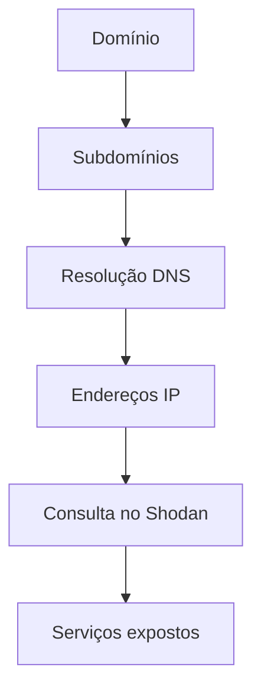

# 🔎 Fluxo de Reconhecimento (Recon)

O **Reconhecimento (Recon)** é a fase inicial de um **pentest ou bug bounty**, onde coletamos o máximo de informações possíveis sobre o alvo antes de tentar explorá-lo.

🎯 **Objetivo:**
Não é apenas encontrar **uma forma de entrar no sistema**, mas descobrir **TODAS as possíveis formas de acesso**.

---

# 📊 Etapas do Reconhecimento

## 🧾 1. Information Gathering (Coleta de Informações)

Nesta fase coletamos **informações gerais sobre o alvo**.

🔎 Exemplos de informações coletadas:

- Domínios
- Subdomínios
- Endereços IP
- Servidores
- Emails
- Tecnologias utilizadas

💡 Aqui utilizamos muito **OSINT**.

### 🌐 OSINT (Open Source Intelligence)

Consiste em coletar informações de **fontes públicas**, como:

- Google
- GitHub
- DNS públicos
- Redes sociais
- Documentações públicas

📌 **Importante:**
Não há interação direta com o alvo.

---

## 🧩 2. Enumeração

Após coletar informações iniciais, começamos a **extrair detalhes dessas informações**.

🎯 Objetivo: **Entender como o sistema funciona**.

### Exemplos de enumeração

- Enumeração de usuários
- Enumeração de diretórios
- Enumeração de serviços
- Descoberta de tecnologias

---

# ⚙️ Tipos de Enumeração

## 🕵️ Enumeração Passiva

Não há contato direto com o alvo.

📚 Utiliza apenas **fontes públicas**.

Exemplos:

- DNS públicos
- Certificados SSL
- Motores de busca
- Repositórios públicos

✔️ **Vantagem:** não gera alertas.

---

## ⚡ Enumeração Ativa

Há **contato direto com o alvo**.

O sistema pode detectar sua atividade.

Exemplos:

- Port Scanning
- Brute force de diretórios
- Requisições HTTP
- Enumeração de serviços

⚠️ Pode gerar **logs e alertas de segurança**.

---

# 🎯 Estratégia no Recon

Durante o reconhecimento devemos:

- ❌ **Evitar ataques agressivos no início**
- 🧠 **Entender a infraestrutura**
- 🔍 **Identificar todas as superfícies de ataque**

Depois disso, escolhemos **a melhor estratégia de exploração**.

---

# 👀 Mentalidade de Análise

Durante o Recon devemos sempre analisar:

### 🔎 O que podemos ver

- O que está exposto?
- Por que está exposto?
- Que informação isso transmite?
- Como podemos usar isso?

---

### 🔒 O que não podemos ver

- Por que não conseguimos ver?
- Existe alguma forma indireta de descobrir?
- O que isso indica sobre a segurança?

---

# 🧠 Princípios de Enumeração

Alguns princípios importantes:

1️⃣ **Há sempre mais do que parece à primeira vista**

2️⃣ **Considere diferentes perspectivas**

3️⃣ **Distinguir entre:**

- o que vemos
- o que não vemos

4️⃣ **Sempre existem outras formas de obter informação**

5️⃣ **Compreender o alvo é essencial**

---

# 🏗️ Metodologia de Enumeração

Para evitar esquecer pontos importantes, utilizamos uma **metodologia estruturada**.

Essa metodologia possui:

- **3 níveis**
- **6 camadas**

Cada camada representa **um obstáculo a ser superado**.

---

# 🧱 Níveis e Camadas da Enumeração

## 🌐 1️⃣ Enumeração de Infraestrutura

### Camadas:

- **Internet Presence**
- **Gateway**

---

## 💻 2️⃣ Enumeração de Hosts

### Camadas:

- **Serviços acessíveis**
- **Processos**

---

## ⚙️ 3️⃣ Enumeração do Sistema Operacional

### Camadas:

- **Privilégios**
- **Configuração do S.O**

---

# 🧭 As 6 Camadas da Enumeração

## 🌍 Camada 1 — Internet Presence

Identificar a **presença do alvo na internet**.

🔎 Informações buscadas:

- Domínio
- Subdomínio
- ASN
- Blocos de rede
- Endereços IP
- Tecnologias utilizadas
- Medidas de segurança

📌 Aqui utilizamos principalmente **OSINT**.

---

## 🛡️ Camada 2 — Gateway

Identificar **mecanismos de segurança** que protegem a infraestrutura.

Exemplos:

- Firewall
- IDS / IPS
- Proxies
- NAC
- VPN
- Cloudflare
- Segmentação de rede

🎯 Objetivo: entender **como a infraestrutura é protegida**.

---

## 🌐 Camada 3 — Serviços Acessíveis

Identificar **serviços disponíveis no sistema**.

Informações coletadas:

- Tipo de serviço
- Porta
- Versão
- Função
- Configuração

Exemplos de serviços:

- HTTP
- SSH
- FTP
- SMTP
- APIs

---

## ⚙️ Camada 4 — Processos

Todo serviço executa **processos internos**.

Devemos identificar:

- PID (Process ID)
- Origem dos dados
- Destino dos dados
- Tarefas executadas

🎯 Objetivo: entender **como o sistema processa informações**.

---

## 🔑 Camada 5 — Privilégios

Cada serviço é executado por um **usuário específico**.

Devemos identificar:

- Usuários
- Grupos
- Permissões
- Restrições
- Ambiente de execução

Isso ajuda a entender **o que é possível fazer dentro do sistema**.

---

## 🖥️ Camada 6 — Configuração do Sistema Operacional

Coletar informações sobre o **sistema operacional**.

Exemplos:

- Tipo de sistema operacional
- Nível de patch
- Configuração de rede
- Arquivos de configuração
- Arquivos sensíveis

🎯 Objetivo: entender **a segurança interna do sistema**.

---

# 🧩 Visualizando o Processo

Podemos imaginar o **pentest como um labirinto** 🧩

Nosso trabalho é:

1️⃣ Identificar brechas
2️⃣ Encontrar caminhos possíveis
3️⃣ Escolher a melhor rota para chegar ao objetivo

⚡ Em **Bug Bounty**, isso deve ser feito **da forma mais rápida possível**, sem perder a qualidade da análise.

---

# 🌐 Informações de Domínio

O estudo do domínio vai além de encontrar **subdomínios**.

Devemos compreender:

- Como a empresa funciona
- Quais tecnologias utiliza
- Quais serviços oferece
- Qual infraestrutura é necessária

📌 Tudo isso pode gerar **novas superfícies de ataque**.

---

# 🧠 O que vemos vs O que não vemos

### 👁️ O que vemos

O **serviço exposto**.

Exemplo:

```
site.com
```

---

### 🔍 O que não vemos

A **infraestrutura necessária para o serviço funcionar**, como:

- Banco de dados
- APIs internas
- Sistemas de autenticação
- Back-end

💡 Devemos pensar **como um desenvolvedor** para entender toda a estrutura.

---

# 🌍 Presença Online

Após entender a empresa, analisamos sua **presença online**.

Objetivo:

- Encontrar novos ativos
- Expandir o escopo
- Descobrir novas interfaces

---

# 🔐 Certificate Transparency Recon

Uma técnica importante é analisar **certificados SSL públicos**.

## 📜 Certificado SSL

Um **certificado SSL** é um arquivo digital que garante:

- 🔒 Integridade dos dados
- 🔒 Privacidade na comunicação

Muitos **subdomínios utilizam o mesmo certificado**.

---

## 🔎 Buscando Subdomínios com crt.sh

Ferramenta:

```
https://crt.sh/
```

Ela permite consultar **certificados públicos**.

---

## 🧪 Exemplo de comando

```bash
curl -s https://crt.sh/?q=meusite.com&output=json \
| jq . \
| grep name \
| cut -d":" -f2 \
| grep -v "CN=" \
| cut -d'"' -f2 \
| awk '{gsub(/\\n/,"\n");}1;' \
| sort -u
```

---

## 🧠 Explicação do comando

### curl

Faz a requisição HTTP:

```bash
curl https://crt.sh/?q=meusite.com&output=json
```

Parâmetros:

- `q=` → domínio pesquisado
- `output=json` → retorno em JSON
- `-s` → modo silencioso

---

### jq

Formata o JSON para ficar **legível**.

---

### grep name

Filtra apenas linhas contendo **name**.

---

### cut

Separa os campos.

Exemplo:

```
cut -d":" -f2
```

- `-d` → delimitador
- `-f` → campo selecionado

---

### grep -v

Remove linhas indesejadas.

```
grep -v "CN="
```

---

### awk

Substitui `\n` por **quebras de linha reais**.

Exemplo:

```
example.com\napi.example.com\nwww.example.com
```

Se transforma em:

```
example.com
api.example.com
www.example.com
```

---

### sort -u

Remove **duplicados**.

- `sort` → ordena
- `-u` → remove duplicados

---

# 🧹 Versão Mais Limpa do Comando

```bash
curl -s "https://crt.sh/?q=%25.meusite.com&output=json" \
| jq -r '.[].name_value' \
| tr '\n' '\n' \
| sort -u
```

🎯 Resultado: lista de **subdomínios únicos** encontrados nos certificados.

---

# 🖥️ Identificando Hosts da Empresa

Durante o **Recon**, é essencial descobrir **quais hosts realmente pertencem à empresa**.

⚠️ **Importante em Bug Bounty e Pentest:**

Não temos autorização para testar **infraestruturas de terceiros**.

Exemplo:

- Muitos sites usam **CDN**, **Cloud providers** ou **serviços terceirizados**.
- Atacar esses serviços **sem autorização** pode gerar problemas legais.

🎯 Portanto precisamos identificar:

- Quais **hosts são realmente da empresa**
- Quais são **infraestruturas terceirizadas**

---

# 🔎 Descobrindo IPs dos Subdomínios

Depois de encontrar subdomínios, precisamos **resolver seus endereços IP**.

Para isso utilizamos **consultas DNS**.

---

## 📜 Comando Utilizado

```bash
for i in $(cat subdomainlist); do
host $i | grep "has address" | grep meusite.com | cut -d" " -f1,4
done
```

---

# 🧠 Explicação do Comando

## 🔁 Loop `for`

```bash
for i in $(cat subdomainlist)
```

Esse loop percorre **todos os subdomínios dentro de um arquivo**.

📄 Exemplo do arquivo:

```
sub1.meusite.com
api.meusite.com
dev.meusite.com
```

Cada item será armazenado na variável:

```
$i
```

---

## 🌐 Comando `host`

```bash
host $i
```

O comando **host** realiza uma **consulta DNS**.

Ele retorna informações como:

- IP do domínio
- registros DNS
- aliases

Exemplo de saída:

```
api.meusite.com has address 192.168.1.10
```

---

## 🔍 Filtrando a resposta

### grep "has address"

```bash
grep "has address"
```

Filtra apenas linhas que contêm **endereços IP**.

Exemplo:

```
api.meusite.com has address 192.168.1.10
```

---

### grep meusite.com

```bash
grep meusite.com
```

Mantém apenas resultados relacionados ao **domínio alvo**.

Isso ajuda a remover possíveis **redirecionamentos ou registros externos**.

---

## ✂️ Comando `cut`

```bash
cut -d" " -f1,4
```

Esse comando separa os campos da linha.

Parâmetros:

- `-d` → delimitador (espaço)
- `-f` → campos que queremos

Campos selecionados:

| Campo | Conteúdo    |
| ----- | ----------- |
| 1     | domínio     |
| 4     | endereço IP |

---

### 📊 Resultado final

Exemplo de saída:

```
api.meusite.com 192.168.1.10
dev.meusite.com 192.168.1.20
```

Assim conseguimos **mapear subdomínios e seus IPs**.

---

# 🌐 Utilizando o Shodan

## 🔎 O que é Shodan?

O **Shodan** é um **motor de busca para dispositivos conectados à internet**.

Ele funciona como um **Google da infraestrutura da internet**.

🔎 Ele indexa informações como:

- Servidores
- Serviços expostos
- Versões de software
- Tecnologias utilizadas
- Dispositivos conectados

---

## 📊 Informações que o Shodan pode mostrar

- SSH
- FTP
- HTTP
- Banco de dados
- Firewalls
- Docker
- Kubernetes
- IoT (câmeras, roteadores)

Exemplo de informação coletada:

```
Apache 2.4
OpenSSH 7.6
nginx
```

---

# ⚙️ Como o Shodan Funciona

O Shodan possui um **crawler próprio** que faz **scan da internet**.

Esse crawler:

1️⃣ Conecta aos servidores
2️⃣ Recebe o **banner do serviço**
3️⃣ Armazena as informações no banco de dados

---

### 📜 Banner

O **banner** é a resposta inicial de um servidor.

Exemplo:

```
Apache/2.4.41 (Ubuntu)
```

Ele pode revelar:

- versão do software
- sistema operacional
- configurações

---

# 🔁 Fluxo de Recon até agora

O fluxo do reconhecimento até este ponto é:

```
Domínio
     ↓
Subdomínios
     ↓
Resolução DNS
     ↓
Endereços IP
     ↓
Consulta no Shodan
     ↓
Descoberta de serviços expostos
```

---

# 🕵️ Consulta Passiva

Consultar o **Shodan** é considerado **reconhecimento passivo**.

✔️ Não enviamos requisições diretas ao alvo.
✔️ Consultamos apenas **um banco de dados público**.

---

### ⚡ Comparação

| Método | Tipo    |
| ------ | ------- |
| Shodan | Passivo |
| Nmap   | Ativo   |

Exemplo com **Nmap**:

```bash
nmap 192.168.1.10
```

Nesse caso o alvo **recebe requisições diretamente**.

---

# 🧪 Consultando IPs no Shodan

## 📜 Comando

```bash
for i in $(cat ip-addresses.txt); do
shodan host $i
done
```

---

# 🧠 Explicação

## 🔁 Loop `for`

Percorre todos os IPs do arquivo:

```
ip-addresses.txt
```

Exemplo:

```
192.168.1.10
192.168.1.20
192.168.1.30
```

---

## 🌐 Comando `shodan host`

```bash
shodan host 192.168.1.10
```

Consulta o banco de dados do Shodan para esse IP.

Ele retorna informações como:

- portas abertas
- serviços ativos
- versões de software
- localização do servidor

---

# ⚠️ Observação Importante

Para usar o **CLI do Shodan**, geralmente é necessário:

- criar uma conta
- obter uma **API Key**
- possuir **plano pago**

---

# 📊 Fluxo Final do Recon



---

✅ Agora você possui um **workflow completo até a fase de enumeração de serviços**, incluindo:

- identificação de hosts
- resolução DNS
- filtragem de IPs
- consulta passiva no Shodan

---
